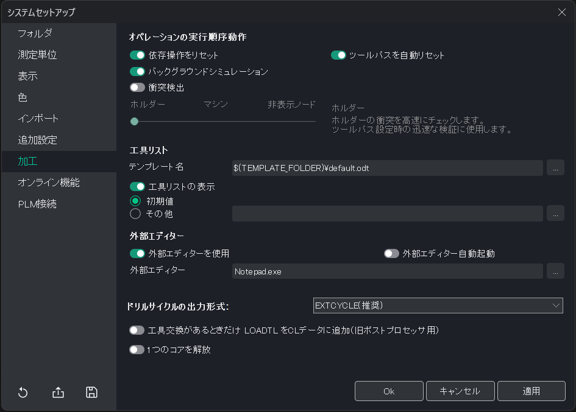

# <加工>タブ

## オペレーションの実行順序動作：

<strong>`オペレーションの実行順序動作`</strong> パネルでは、操作のステータスを計算/リセットに変更するときの動作を制御できます。

- <strong>`オペレーションパラメーターが変更された場合、関連するすべてのオペレーションをリセット`</strong>：前工程の入力データが変更された場合、自動的にツールパスをリセットします。
- <strong>`ツールパス計算後に加工結果を自動計算`</strong>：ツールパスの計算直後にバックグラウンドシミュレーションを自動的に開始します。

## 工具リスト：

工具リストは、 [工具リスト生成](13.md)のパラメータを設定するために使用されます。

工具リストは <strong>HTML</strong> フォーマットで作成できます。

工具リストを生成する際、システムはテンプレートを使用します。いくつかのテンプレートがインストールパッケージに含まれており、その中から必要なテンプレートを選択できます。新しいテンプレートを作成することも可能ですが、 <strong>HTML</strong> の知識が必要です。詳細については、[サポートデスク](811.md)までお問い合わせください。

一度作成したHTMLドキュメントは、すぐに保存することも、必要に応じて閲覧、編集することもできます。工具リストを表示せずに保存するには、 <strong>`工具リストの表示`</strong>の選択を解除します。

作成された工具リストファイルを表示するには、そのファイルタイプ用のデフォルトプログラムまたはユーザー定義プログラムのいずれかを使用できます。編集ツールとして他のプログラムを使用する場合は、使用したいアプリケーションの実行ファイルのフルパスを指定します。

## 外部NCエディターパネル：

<strong>`外部NCエディター`</strong> パネルは、NCプログラムを表示するための外部アプリケーションを指定するために使用します。システムは特定のコマンドラインパラメーターを認識します。

- <strong>`$NCOUTPUTNAME$`</strong>：ポストプロセッサーが生成するNCプログラムファイルの名前です。
- <strong>`$CD.**ItemName**$`</strong>：適切な項目の値に置き換えられるカスタムデータキーワードです。

<strong>`Autorun NCエディター`</strong> チェックボックスを選択すると、ポストプロセッサーでNCプログラムが生成された後、指定したNCエディターが自動的に起動します。

## ポストプロセッサー互換性設定：

旧バージョンのポストプロセッサとの互換性を確保するため、穴あけ加工工程で非拡張ツールパス出力方式が使用されている場合、ドリルサイクルの出力形式を変更する機能を提供しています。

<strong>ドリルサイクルフォーマット</strong> パラメーターは以下の値を設定できます。

- <strong>`EXTCYCLE（推奨）`</strong>：これは、高度なパラメータセットを含む新しいフォーマットで、システムに実装されたすべての加工方法をサポートし、選択した加工方法に従って工具の動きをリアルにシミュレーションすることができます。
- <strong>`CYCLE（古いポストプロセッサー用）`</strong>：この古いフォーマットは、古いポストプロセッサーとの互換性のために必要です。いくつかの加工方法（穴ポケット加工やらせん加工など）には対応しておらず、どのような加工方法も穴の下層への単純な移動としてシミュレーションします。

## パフォーマンスオプション：

<strong>`1つのコアを解放`</strong>：マルチコア処理中に1つのコアを空き状態に保ちます（※再起動が必要です）。
