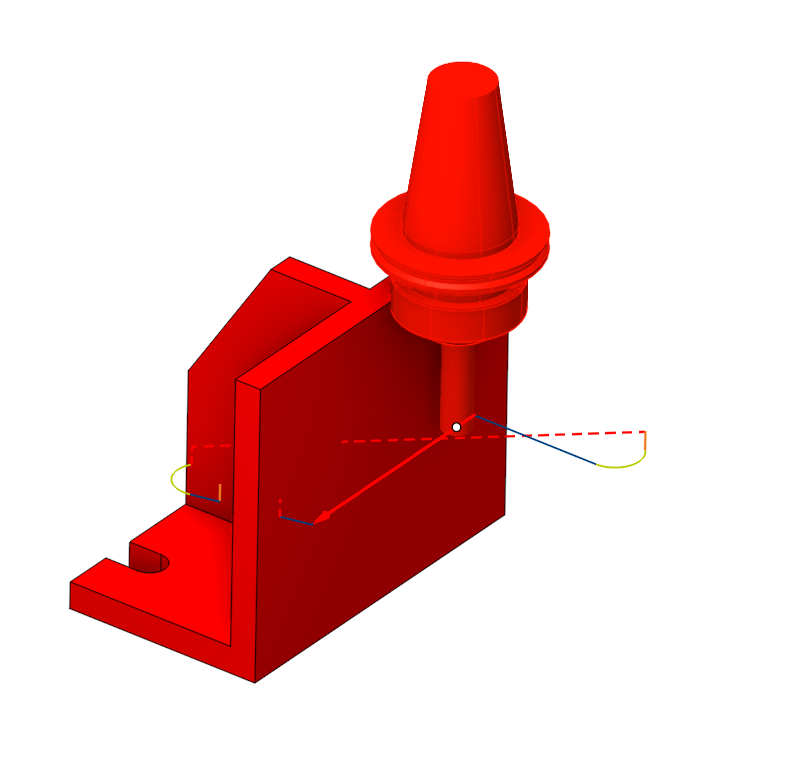
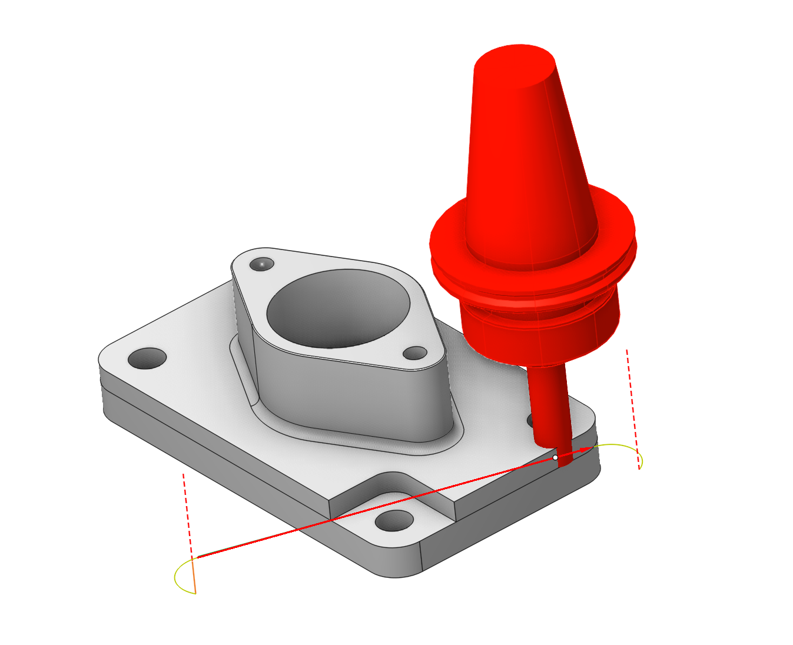

# Tool path errors detected by simulation

 

## Application area:

The section covers error identification in tool paths during simulation, and provides filter controls to selectively display or suppress specific error types for focused analysis.

In the CAM system, on the <strong>Technology tab</strong>, operations have status indicators reflecting their current state. [Details](1118119.md)

On the <strong>Simulation tab</strong>, each CLDATA row has its own status, enabling quick identification of any issues. The status of the node is indicated by an icon:

-  - CLDATA commands are disabled. It is not output to the NC program and not simulated.

-  - CLDATA commands are not simulated.

-  - CLDATA command is simulated without errors.

- CLDATA command is simulated with error (<strong>various icons may appear here; they will be described in detail below</strong>.);

-   - CLDATA command is idle. The stock is not removed by this tool motion command.

During operation, various checks are performed. If an error occurs, the CLDATA row is marked with the corresponding icon.

The following <strong>types of errors are checked</strong>:

-  - Stock removal by rapid feed is forbidden. If the stock is removed and the feed rate is rapid, then the command is marked as an error.
-  - Toolholder collision. If the toolholder touches the workpiece when the CLDATA command is marked as an error;
-  - Impossible to calculate the compensation. Tool radius compensation is performed while doing the simulation. The compensation value is defined in the operation parameter window on the tool bookmark. If compensation cannot be made for the CLDATA command, then the motion is marked as an error;
-  - Tool plunge cuttings with an angle exceeding the maximum value specified in the tool parameters are marked as errors.
-  - Collision of machine nodes.
-  - Gouging the part is detected.
-  - Axis travel over the limits.
-  - Inappropriate tool and spindle rotation direction error.
-  - Tool overload (appears if option  Mark overloads is enabled in *the Adaptive federate* section on *the Feeds/Speeds* parameter panel for roughing waterline operation). [Details](100142.md)

<strong>Collision Check Level Panel.</strong>

This panel contains buttons similar to those used for <strong>Background</strong> <strong>Simulation</strong>. [Details](18921.md)

There are several important considerations when working with this panel:

- By default, on the <strong>Simulation</strong> <strong>tab</strong>, the collision check level matches the check level of <strong>Background</strong> <strong>Simulation</strong>. That is, when you change the <strong>Background</strong> <strong>Simulation</strong> check level in the system settings and click <strong>Apply</strong>, the collision check level settings on the <strong>Simulation tab</strong> are automatically updated (Only if the verification level on the <strong>Simulation</strong> tab was higher than that of <strong>Background</strong> <strong>Simulation</strong>).
- On the <strong>Simulation</strong> <strong>tab</strong>, you can set a check level that differs from the <strong>Background</strong> <strong>Simulation</strong> settings — but not lower than the level defined in <strong>Background</strong> <strong>Simulation</strong>. Decreasing the check level is not allowed.

<strong>Example.</strong> <em>If</em> <em>the <strong>Machine</strong> check level is selected in <strong>Background</strong> <strong>Simulation</strong>, it cannot be lowered below this value on the <strong>Simulation</strong> <strong>tab</strong>. However, you can increase the check criterion by moving the slider to the <strong>Hidden Nodes</strong> position. This will help detect additional errors, if any are present.</em>

- When you increase the check level on the <strong>Simulation tab</strong> after performing a <strong>background</strong> <strong>calculation</strong>, the operation status is reset to the value _(1).png). Similarly, changing the Simulation accuracy will also reset the operation status.
- If you run a <strong>step‑by‑step</strong> <strong>simulation</strong> and lower the check level below that of <strong>Background</strong> <strong>Simulation</strong>, the operation statuses will change depending on the current check level.

<strong>Example.</strong> <em>If</em> <em><strong>Holder</strong> is set as the check level in <strong>Background</strong> <strong>Simulation</strong> and a <strong>step‑by‑step</strong> <strong>simulation</strong> is then performed with the <strong>Hidden Nodes</strong> check level, lowering the check level to <strong>Machine</strong> or <strong>Dressing</strong> will cause the operation statuses to update. <strong>The</strong> <strong>user will see only those errors that correspond to the selected check level.</strong></em>

<strong>Part gouge.</strong> Allows displaying errors where gouging of the part has been detected.

Additionally, the system includes dedicated auxiliary buttons that allow users to <strong>stop full simulation</strong> under different conditions:

-  - Allows stopping at CLDATA rows where the M1 stop command is specified. The M1 command can be inserted using the <strong>Macro of Toolpath Template functionality</strong>. [Details](500.md) For better visualization of the technological process, an <strong>Auxiliary operation</strong> can be created, and the M1 command can also be set in the <strong>Macro of Toolpath Template section</strong>. [Details](10075.md)
-  - Allows stopping after each operation.
-  - The button defines the action, then the error is detected. If the button is down, then the simulation process is break after the error detecting. Else, the node is marked by the red exclamation mark and the simulation process goes on. After the simulation, it is possible to find the marked nodes by shortcuts or from the context menu:

-  - Go To Next error – move the selection to the next error, marked node;

-  - Go To Previous error – move the selection to the previous error marked node.
