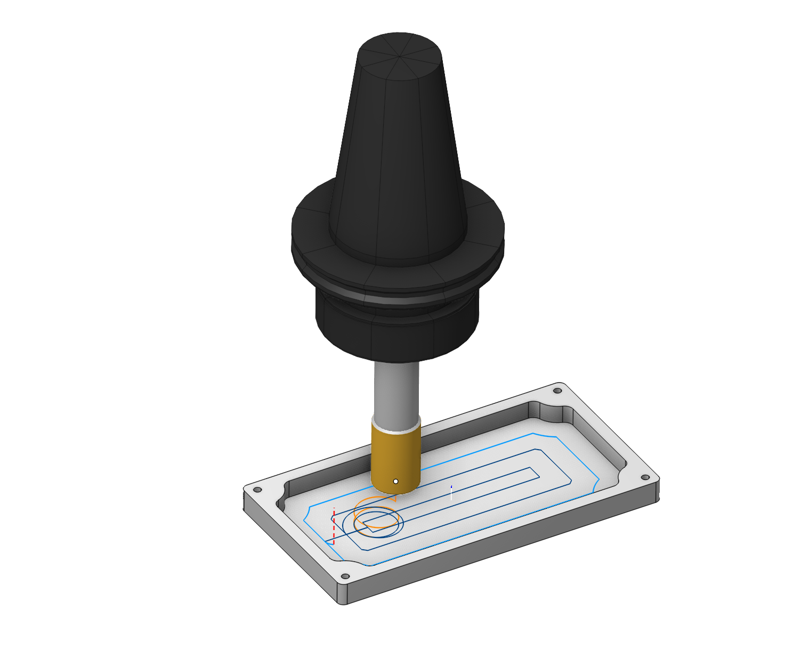
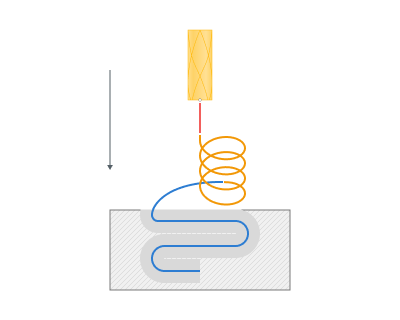
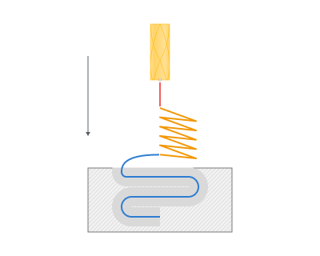
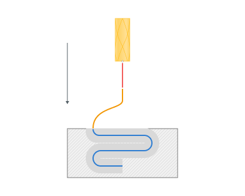
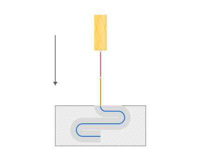
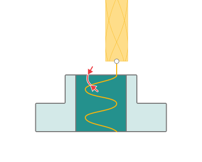
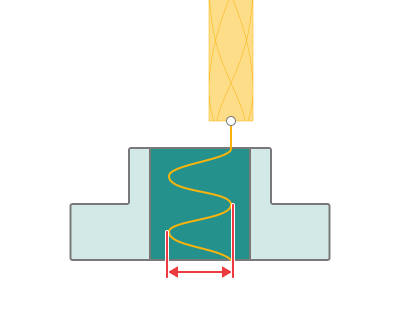

# Allow plunges

## Application Area:

When it is impossible to approach the machining area from the outside, the system automatically generates a plunge movement to the first point of the work pass. A plunge is a toolpath section along the Z axis within the workpiece body. The <strong>Plunge</strong> is performed as follows:

- Tool approach to the XY plunge point at the [safe plane](100117.md) of the operation.
- Traverse vertically at rapid feed to the safe level or the safe distance before cutting begins (depending on settings). The safe level is the Z top level of the current coordinate system. The safe distance is the distance to the start of the defined plunge.
- Vertical descent at the approach feeds into the beginning of the defined plunge.
- The selected plunge method is applied at the approach feed to the approach point.
- Approach starts.

### The following plunge methods are available in the system:

<strong>None.</strong> Set it if you don't want to try plunge.

<strong>Spiral.</strong> The tool performs a helical motion along a circle, connected at its last point with the first approach point. The radius of the circle is a user-defined option.

Zigzag. The tool performs reciprocal movements along a straight section, connected to the first approach point. The length of the section is a user-defined option.

<strong>Along curve.</strong> The tool plunges along the approach curve. The plunge move is completed at the end of the approach move.

Axial. Performed along the vertical straight to the first point of approach.

<strong>Ramp angle. Plunge Angle</strong> determines the speed of plunging. The greater the angle the faster the tool plunges into material.

<strong>Min size.</strong> The Plunge <strong>Min size</strong> defines:

- the minimum allowed diameter of a spiral in Spiral Plunges,

- the minimum allowed amplitude of zigzag moves in <strong>Zigzag</strong> and <strong>Along Curve</strong> Plunges.

If CAM software can not form a gouge-free plunge of the selected type with the given minimal size, it tries to use the next available Plunge Type. If no more plunge types are available the pocket is left unmachined.

<strong>Max size.</strong> The Plunge <strong>Max size</strong> defines:

- the optimal diameter of a spiral in Spiral Plunges,

- the optimal amplitude of zigzag moves in Zigzag and Along Curve Plunges.

When CAM software can not form a gouge-free plunge of the selected type with the given optimal size, it tries to decrease the size by the amount specified in the <strong>Degression</strong> parameter until either the plunge becomes possible or the size reaches the minimum allowed value, then CAM software tries to apply another Plunge type from the list.

<strong>Degression.</strong> <strong>Degression</strong> defines the value by which CAM software decreases the plunge size when it can not form a gouge-free plunge. When CAM software can not form a gouge-free plunge of the selected type with the given optimal size, it tries to decrease the size by the amount specified in the <strong>Degression</strong> parameter until either the plunge becomes possible or the size reaches the minimum allowed value, then CAM software tries to apply another Plunge type from the list.

<strong>Smooth radius.</strong>

<strong>If enabled:</strong> The connection of plunge motion and horizontal motion is rounded by smooth radius.

<strong>If disabled:</strong> The plunge toolpath is connected with the first horizontal motion under plunge angle.
