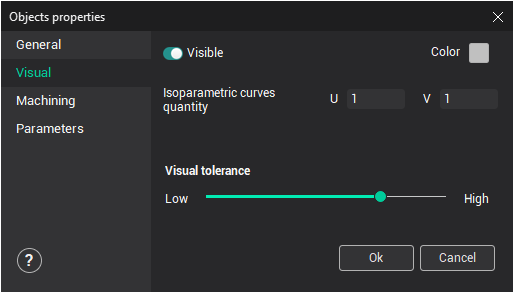

# Visual tab

Access to the visual properties of objects is duplicated on the visual properties tab: visibility and color. It is also possible to assign the number of isoparametric lines and the object's visual tolerance in the graphic window.

- **Visible** – if unchecked, then the selected object will not be displayed.
- **Color** – allows changing the color of the selected object.
- **Isoparametric curves quantity** – when displaying surfaces it is sometimes necessary to define the number of displayed isoparametric curves. On this tab it is possible to define the number of curves by adjusting **U** and **V** parameters. When the value is zero, isoparametric curves are invisible, when it is one – surface borders are visible, when it is two – every surface segment is divided by two etc. When displaying curves and surfaces on the screen, the system approximates the curve by using lines and surfaces by flat polygonal edges.
- **Visual tolerance** – allows the user to set the visual quality of 3D objects, or to find a compromise between satisfactory visualization quality and computer speed. The tolerance is adjusted using the slider bar control. Tolerance in this case is the maximum approximated deviation of sections used when drawing the curves on the screen. The higher the visualization tolerance of 3D objects, the more memory resources will be taken to draw them on the screen.

<em>Note: It is not recommended to set high visual tolerance on slower computers. Computer performance may be affected.</em>

The original visual tolerance, when loading the model, is defined in the [system settings](24.md) window.
