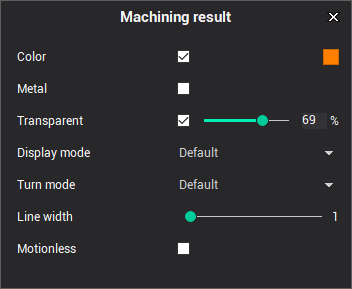
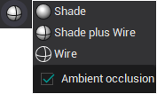

# Geometrical parameters of an operation

The geometrical parameters of an operation are displayed in the view. Those include the part, the workpiece, the fixtures and the job assignment. The visual properties of the parameter can be edited using the light icon next to the parameter's node. Left-click on that icon switches the object on/off. However, a selected parameter is always visible irrespective to its state.

In pop-up menu you can specify the object color, the transparence as well as select its display mode.

The **defaults** display mode is used to specify the object should be displayed using the global settings set with the button on the main toolbar.

The rest of the modes force an object to be displayed irrespective to the global settings.
