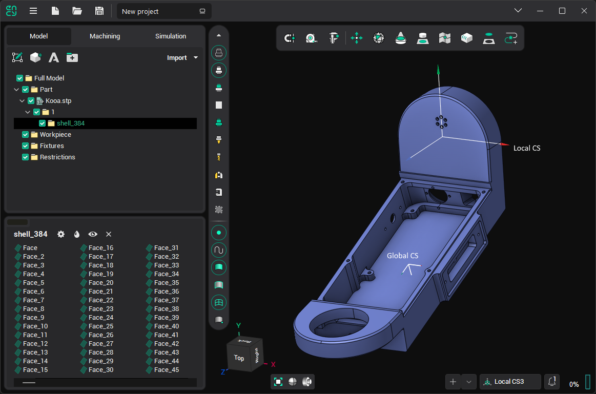
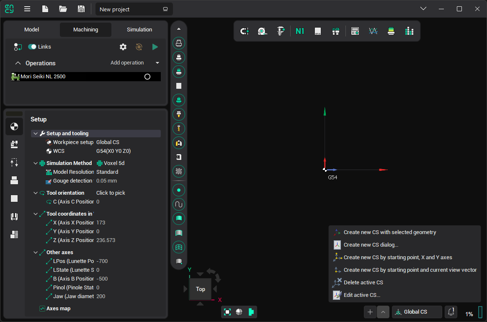

# Geometrical coordinate systems

It is possible to create any number of local geometrical coordinate systems (CS) to make the machining process generation more convenient.

These systems can be useful when working with geometry, for example, if you need to [draw a contour](833.md) in an arbitrary plane or check the dimensions of an object. They are also helpful when setting operation parameters ([Workpiece CS](10068.md), [Local CS](726.md), rotary axis, [toolpath multiplying](10168.md) plane), etc.

<strong>The Coordinate Systems Management Panel</strong> located in the lower side of the main window

There is a concept of an <strong>active coordinate system</strong>. Only one CS can be active at any given time, and its name is displayed on the panel. Some system features take the active coordinate system into account, such as displaying the overall dimensions of geometric objects in this CS, or initializing a new sketch plane based on the active CS.

Click on the name of the CS in the panel to open the list of CS and change the active one.

The button next to the CS name has a drop-down menu that contains possible actions for coordinate systems:

-  <strong>[Create new CS dialog...](402.md)</strong>: Opens a window where you can directly set the parameters of a new CS. If any geometric element is selected at the time of the click, the window will not open, and the [smart CS creation](10007.md) procedure will start instead.
-  <strong>[Create new CS by starting point, X and Y axes](271.md)</strong>: Defines the new coordinate system interactively by selecting the origin point and two leading vectors, X and Y.
-  <strong>[Create new CS by starting point and current view vector](805.md)</strong>: Defines the new coordinate system interactively by selecting the origin point and using the current view vector.
-  <strong>Delete active CS:</strong> Deletes the active coordinate system. All coordinate systems listed below it will shift up by one level. The global coordinate system cannot be deleted.
-  [Edit active CS](403.md): Opens the parameters window for the active coordinate system.
