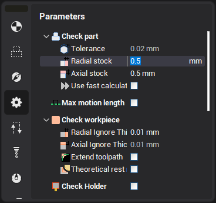

# Stock

The stock is a layer of material on the detail surface, which needs to be left after an operation for further rest milling.

A positive stock defines the excess thickness of the material to be left, and negative – the material removed from the detail surface.

In reality, the minimum thickness of the remaining material is strictly equal to the stock only when the inner deviation value is zero. In other cases, the minimum layer thickness is less then the defined stock by the inner deviation amount.

The stock can be assigned in the **Parameters** page.

