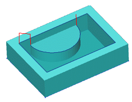
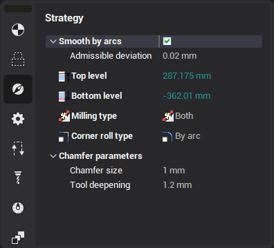

# 2.5D chamfer machining operation

This operation is designed for chamfering or rounding of horizontal edges of a model.

The model creation method for this operation is identical to the model creation method for the other 2.5D machining operations.

Having created the model the user opens the chamfer parameters window by pressing the operation **Parameters** button.

The default for all elements of the model is for no chamfer to be produced, which means that in the chamfer machining operation these curves will be ignored. For a chamfer to be machined it is necessary that the required curve has a chamfer value assigned in the Chamfer type dialogue. The size of the chamfer is assigned by two values, the height of the chamfer – is the distance from the top part of the element to the end point of the tool, and the width of the chamfer.

The same should be done for all elements that need to be machined in the operation. The sequence of actions can be performed either on one curve or on a group of curves, if the chamfer parameters for them are the same.

For the operation the user can also assign milling type, corner roll type, curves approximation and step-over type.
