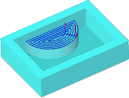

# 2.5D cover machining operation

This operation is designed for the machining of horizontal areas of a model – these are known as "covers".

The method for defining the model for machining of horizontal areas is identical to the model definition method for other 2.5D machining operations.

The operation performs removal of workpiece material, which is located above the horizontal areas of the model being machined and outside any restricted areas. The workpiece, machining areas and the restricted areas are assigned by projections of closed curves.

Depending on the defined strategy, the material of a layer can be removed using spiral strokes, starting at the center moving outwards, from the outside inwards, or by parallel passes. In the operation the user can also define milling type, corner rolling and corner smoothing.
