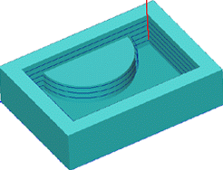

# 2.5D wall machining operation

This operation is designed for machining the vertical walls of a models.

The method of creation of the model being machined is described in detail in chapters 2.5D pocketing operation.

The operation performs removal of workpiece material, which is located along walls of the model being machined and outside any restricted areas. The workpiece, machining areas and the restricted areas are assigned by projections of closed curves.

The material is removed in layers, using the defined step between layers. In the operation strategy the user can define the milling type, the corner roll type and corner smoothing if required.
