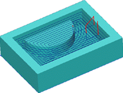

# 2.5D pocketing operation

The operation is used for machining of pockets and islands, and for preliminary material removal.

The model being machined is formed from the visual model that has been created from a set of flat curves and points. The visual model is created by successive addition of curves or groups of curves into a model. Any curve can define a ridge or a ditch of a defined thickness by means of the additional stock; closed curves can be added as a ledge or a cavity. Additional stock can be assigned for every curve or groups of curves.

In the operation the system performs removal of the entire workpiece material, which is located outside the model being machined and the restricted areas. The workpiece, machining areas and the restricted areas are defined by projections of closed curves.

Material is removed layer by layer, using the defined step between layers. Depending on the defined strategy, the material of a layer can be removed using spiral strokes, starting at the center moving outwards, from the outside inwards, or by parallel passes. Plunge to the next machining depth can be performed either by one of plunge methods (axial, spiral, zigzag), or through

With drill points, the system will first search for a hole of an appropriate diameter and depth in the holes list for the operation, and then in the open holes list of the machining process. If no appropriate hole is found, then coordinates for the hole center will be created automatically by the system. The coordinates of the center of the new hole, if possible will be round numbers (integers).
