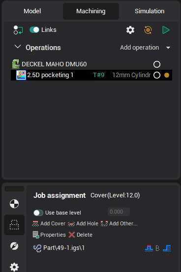
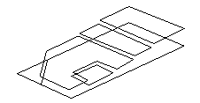
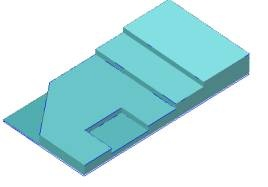

# 2.5D machining operations

These operations are designed for creating NC programs for models, which have pockets, ledges, flat areas etc., for which it is not always efficient to construct a surface/solid model.

The visual model is formed from flat areas limited by closed profiles, located at different heights that have walls between them. Open (unclosed) profiles and points can also be used in the construction of the visual model.

In the 2.5D operations, the system allows the user to visually create the geometry of a model by using flat profiles. If the parameters of a profile are changed, the displayed model is updated automatically. The operation processes the list, which consists of an arbitrary number of profiles and curve projections. For every object there is an individual machining method.

If the user defines a [workpiece](738.md) or [restricted areas](10283.md), then only those areas of the defined profiles that lie inside the workpiece and outside the restricted areas will be machined. And if no workpiece or restricted areas are defined, then the system will perform machining of all the defined profiles without any limitations.

Machining is performed by a series of horizontal passes of the [tool](37.md). The passes differ from each other only by the depth at which they are located. The number of such passes and their Z depth depend on the machining levels and the step defined on the parameters page in the **Operation parameters** window.

In the same window, the user can set up the [machining tolerance](100112.md) and the stock.

All 2.5D operations use 2D curves to define the model. Formation of the model is performed in the [Model](718.md) window, where one can assign parameters for either a group of elements or a single element.

The system dynamically displays the 3D model in the graphic window, updating as any alterations to the parameters for elements are made in the [Model](718.md) window.

|  |  |
|---|---|
| Curves that assign the model | Created model |
