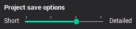

# Projects files

A project is a file with the extension ".stcp" saved on disk (previously used the extension ".stc" ). It stores inside itself the information that the user generated while working in the system, when creating a program for a specific part machining, and which is minimally necessary for its subsequent restoration in the application later. This is for example information such as

- Geometrical models of the part and workpiece.
- Machining technology - the list of operation in a defined order. Each operation contains all the necessary information in order to machine a separate region of the part - links to the geometrical curves or faces, machining strategy parameters (sequence flags, steps, tolerances and so on).
- Information on the necessary equipment: machine settings, tool list.
- The resulting toolpath in the form of machine independent CLDATA.

The data storage format inside the project's *.stcp file is a kind of multi-file archive. Thanks to this, it is possible to save some files inside the project (in addition to the basic information listed above) that are needed to fully work with the project, but which are stored separately on the computer. As a result, the project can be freely transferred and opened on any other computer. These can be files such as machine schema files, files of 3D models of tools. During normal user work on his computer, the project refers to the corresponding external files, and a copy of them is written inside the *.stcp file. However, if the project is then transferred to another computer and the desired external file does not appear, then the system switches to working with the version of the file that is stored inside the project. Due to the fact that storing additional files within a project can increase its size, this feature can be disabled in the system settings.

The saving mode can be changed in the [System setup](715.md) window.

- Short mode. Minimal source data only saved - geometrical model, coordinate systems, technological operations and their parameters. Any information which can be recalculated is not saved.
- First intermediate mode. Calculated toolpath is saved in addition to the previous data.
- Second intermediate mode. The external files that the project uses are copied inside it: 3D models of used equipment and so on.
- Detailed mode. Intermediate states of the workpiece and geometry cache data are saved additionally to the all modes above.

Use Save and Open project buttons on the main toolbar to create/restore the project file. Projects can also be opened by using the drag and drop function, i.e. simply by dropping the project file (*.stcp) onto the main window of the application. A project file can be opened also if the file name is added as a parameter into the shell command line.
