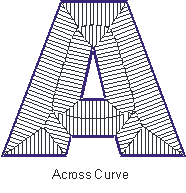
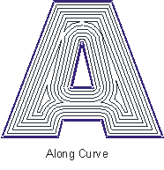
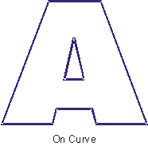
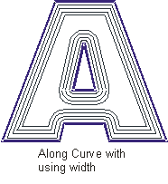
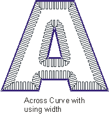

# Machining methods in drive operations

In the drive operations, the view of the [tool](37.md) toolpath in the plane is defined by the drive area, which is formed from the defined drive curves. The Z coordinate is calculated according to the condition by which the [tool](37.md) touches the surface being machined.

Projections of the tool work passes onto the horizontal plane are always located inside the drive area. The method defining the formation of these projections can be assigned by one of the following methods:

- **On curve** – performs only one pass along the area borders. That is, performs machining of the detail so that the tool axis is always on one of the curves, which limit the drive area.
- **Along curve** – the first pass is performed along the area borders, and all following passes – equidistant in the horizontal plane to the previous pass. In other words, when creating work passes the tool axis goes along the curves, which are equidistant to the area borders. The step between the neighboring passes is equal to the defined machining step.
- **Across curve** – the horizontal projection of every stroke represent a section, which starts on the border of the drive area, and is perpendicular to this point. The length of this section is selected so that the same area is not machined twice, and the point closest to it on the border assigns the directions of the passes for every point inside the area.

The number equidistant passes when machining along curve, and the length pf passes when machining across curves, in general is limited by the form and the dimensions of the drive area. Work passes are constructed until the entire model, which is inside the drive area, has been machined.

If the user activates the "width" mode, then using the selected method (along or across) only that width along the borders of the drive area will be machined. This means that the number of equidistant passes will be additionally limited by the width of the area being machined.

The view of the trajectories with different combinations of parameters set.

The machining method for the drive operations can be assigned in the **Strategy** page.
