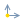
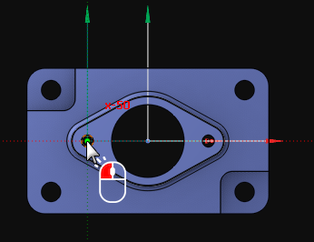
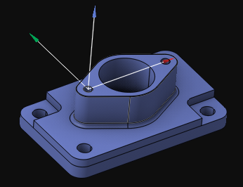

# Creation of the coordinate system by the current view direction

Creating a new coordinate system in this way is activated by pressing the  menu item on the [coordinate systems panel](753.md).

When creating the coordinate system by this method, the required [view](20.md) must first be set, or one of the [standard views](728.md) can be selected. Next, an origin point must be assigned by moving the cursor to the desired point in the [graphic window](169.md). If it is a valid point that can be used as the origin of the coordinate system, it will be highlighted. The selection is confirmed by left-clicking on it:

After that, the newly created coordinate system becomes active:

At any time, the name of the coordinate system, its color, and its origin point can be [changed](403.md).
