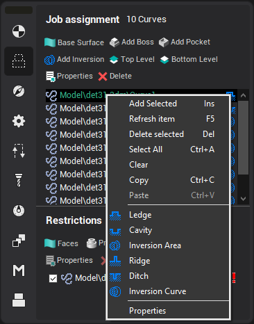
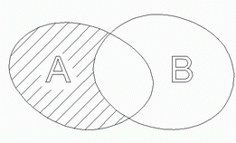
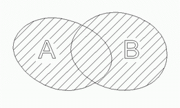
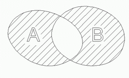
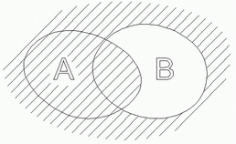
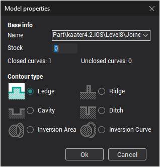

# Job assignment for engraving and pocketing operations

## Application Area:

For the [engraving](810.md) and [pocketing](256.md) operations, the model is defined by curves as for the 2D and 3D curve machining operations. However, unlike the curve machining operations, the system forms a [model for machining](294.md) from the defined curves. A model for machining represents a flat area, which only exists where there is the curve to be machined. The task of the user is to create areas from the available curves. Every curve is a 'border' of the model. Its selected type defines how each 'border' is machined:

### Boundary types

- **Ledge** – indicates a closed area, which will not be machined;
- **Cavity** – indicates a closed area, which will be machined;
- **Inversion area** – indicates a closed area, inside which the machining rules will be reversed, i.e. machined areas will become unmachined and vice versa;
- **Ridge** – indicates a curve along which material will not be removed;
- **Ditch** – indicates a curve along which material will be removed;
- **Inversion curve** – indicates a curve along which machining will not be performed, if it goes into machining area or vice versa.

A **Ledge**, **Cavity** or **Inversion area** can only be defined by closed curves. When an open curve is selected, then these types will be unavailable. If a closed contour consists of several fragments, then it must be [joined](400.md) into a single curve (see [Curve joining](400.md)). A **Ridge**, **Ditch** or **Inversion curve** can be defined by any curve, either closed or not. To define their thickness, use additional stock.

### Forming the machining area

The formation of an area is performed by successive execution of Boolean operations on the selected curves. The order that the curves appear in the list is important. The first object of the list dictates the status of any unbounded area, i.e. workpiece area not enclosed by any curves. Should the first object be a **Cavity** or a **Ditch**, then the model is considered to occupy the entire unbounded area, otherwise machining is possible in this area. All subsequent objects modify the area of the model by the method with which they are defined. If an object is a **Ledge** or **Ridge** it will be added to the area occupied by the model. If an object is a **Cavity** or **Ditch** it is subtracted from the area occupied by the model. If an object is an inversion area or curve, then it will reverse the status of the area it overlays. Should a group consisting of several curves be an element of the list, then an area will be formed from that group by inverse addition of each curve; the obtained area modifies the result according to its defined type. Surfaces, faces and points that enter the group, are ignored.

The results of area formation by two curves are shown in the pictures below. Model (solid) areas are shaded.

| List contents | Resulting area |
|---|---|
| A – ledge B – cavity |  |
| A – ledge B – ledge |  |
| A – ledge B – inversion area |  |
| B – cavity A – ledge |  |

Take a look at the first and the last examples. In both cases curve A is a **Ledge** and curve B is a **Cavity**. In the first case the size of the model is defined by the curve A, with further subtraction from its area limited by the curve B. In the last case, curve B defines the area where machining can be performed, curve A further limits machining in area B.

The order of the geometrical objects in the list can be changed by mouse dragging. The model being formed can be dynamically displayed in the graphical window.

### Item properties

There is the properties window to set the selected item parameters. The window can be opened by the double click on the item or from the pop-up menu. The window is shown below.

<em>Note: Dynamic showing of parameters possible only in a **Shade mode**. For turn on it press the  button on the main panel.</em>
