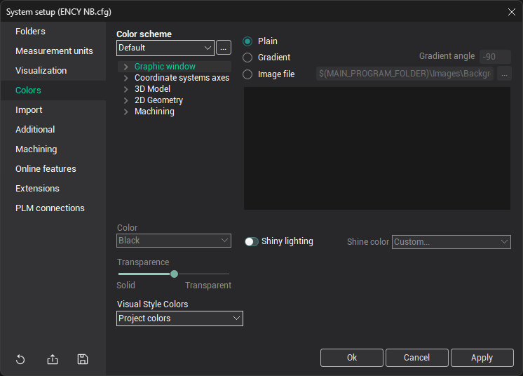

# Colors tab

In the <strong>Color scheme</strong> field, it is possible to select one of the predefined color schemes. By pressing the  button, it is possible to restore the default color values or, if the <strong>Another</strong> color scheme is selected, to load values from another color scheme.

Below the color scheme, a tree-like structure shows the color values for individual elements. These elements are grouped as follows: <strong>Graphic window</strong>, <strong>Coordinate systems axes</strong>, <strong>`3D Model`</strong>, <strong>`2D Geometry`</strong>, <strong>Machining</strong>. By expanding the necessary group, you can edit the color values for any element. The color of a selected element is set in the <strong>Color</strong> field by choosing the desired value from the drop-down list. The <strong>Transparence</strong> slider allows you to adjust the transparency of the selected element.

You can also choose the background of the graphic window:

- <strong>Plain</strong>: A solid background. The color is set in <strong>Graphic window -> First background color</strong>.
- <strong>Gradient</strong>: A gradient background. The colors are set in <strong>Graphic window -> First background color</strong> and <strong>Second background color</strong>. The <strong>Gradient angle</strong> field allows you to set the angle of the gradient relative to the vertical axis.
- <strong>Image file</strong>: Use a graphic image as the background. Supported formats are <strong>BMP</strong> and <strong>JPEG</strong>.
- <strong>Shiny lighting</strong>: Enables an additional light source for enhanced visuals.
