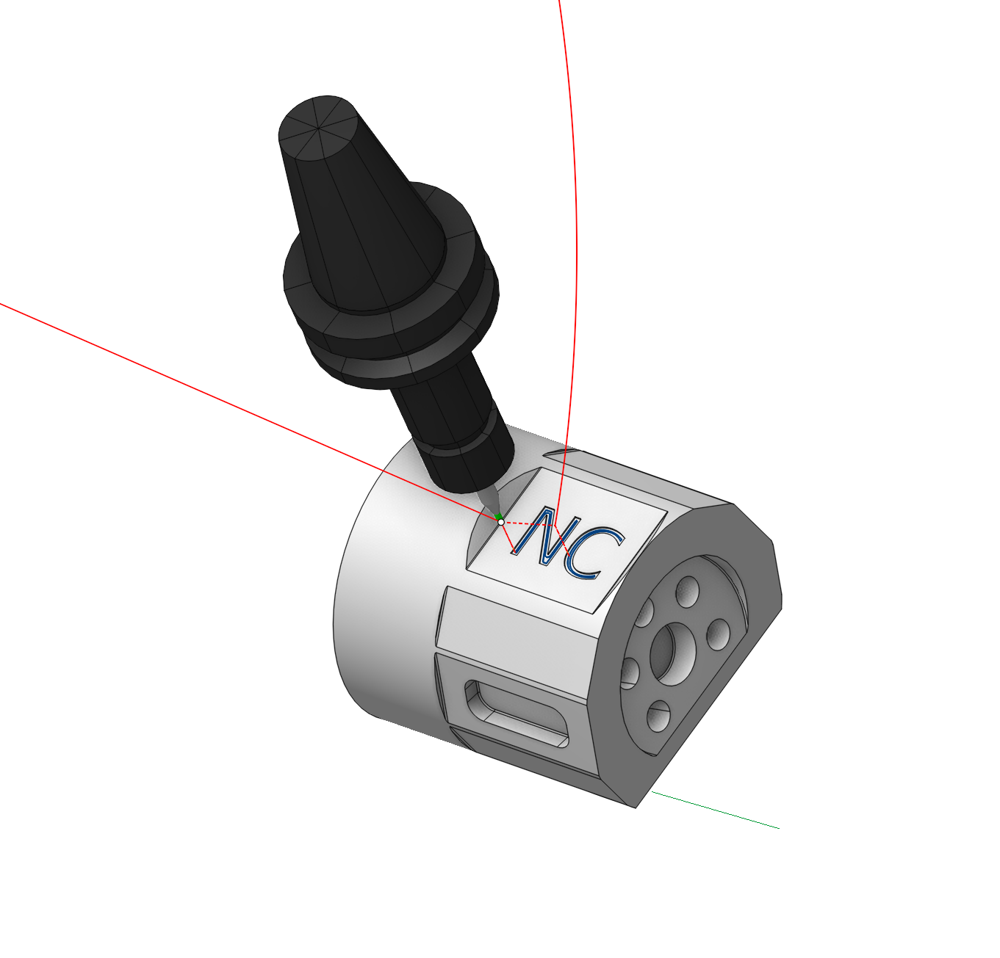

# Engraving

## Application area:

This operation is designed for the engraving of drawings and inscriptions on flat areas, and also for performing a finish pass along the side walls of pockets and contours using 2 / 2.5D machining.

### Setup:

The <strong>Setup</strong> tab is used to configure the primary parameters of the project. This can involve the positioning of the part on the equipment, the coordinate system of the part, and more. [Details](1022.md)

### Job assignment:

<strong>Base surface.</strong> This surface serves the purpose of projecting a trajectory onto it. [Details](10156.md)

<strong>Add Boss.</strong> Allows you to add a boss. [Details](806.md)

<strong>Add Pocket.</strong> Allows you to add a pocket. [Details](806.md)

<strong>Add Inversion.</strong> Indicates a closed area, inside which the machining rules will be reversed, i.e. machined areas will become unmachined and vice versa. [Details](806.md)

<strong>Top Level.</strong> Specifying the top level by model elements. [Details](10153.md)

<strong>Bottom Level.</strong> Specifying the bottom level by model elements. [Details](10153.md)

<strong>Properties.</strong> Displays the properties of an element. It is possible to add the stock. You can also call this menu by double clicking on an item in the list.

<strong>Delete.</strong> Removes an item from the list.

<strong>Restrictions.</strong> It allows you to restrict areas that should not be machined. [Details](101231.md)

### Strategy:

#### V Carving.

It adds additional passes to the trajectory to achieve a higher quality result, which is particularly effective for creating small elements.

Click here to expand..

.png) .png)

#### Machining levels:

It defines the range along tool axis for the machining. This parameter group works similarly to the <strong>Waterline roughing operation.</strong> [Details](736.md)

#### Depth Step:

Material removed in one pass along the tool axis between the <strong>Top</strong> and <strong>Bottom</strong> levels. This parameter group works similarly to the <strong>Pocketing</strong> <strong>.</strong> [Details](256.md)

#### Milling type:

Сan be assigned in almost all operations, except for the curve machining operations. This allows the user to control the required milling type (climb or conventional) during the toolpath calculation process. This parameter group works similarly to the <strong>Waterline roughing operation.</strong> [Details](736.md)

#### Sorting:

Controls the sequence of toolpath passes during the surface machining.. This parameter group works similarly to the <strong>2D contouring.</strong> [Details](404.md)

#### Corners:

When there is a sudden change of the tool direction, the milling control performs deceleration before starting the turn, and then accelerates again. This fact can lead to vibrations and high tool and milling machine wear. The problem can be solved if the toolpath has very few or no breaks. For this reason, in the system there is the toolpath smoothing function using the defined radius for machining inner or outer corners of the model.

Some parameter group works similarly to the <strong>2D contouring - <strong>Corners smoothing</strong></strong> <strong>.</strong> [Details](713.md)

#### Tool contact point.

Tool Contact Point (TCP) is a specific location on a cutting tool that defines the primary interaction point between the tool and the workpiece surface or geometric entities during machining operations.

The parameters of this group are the same as in the <strong>5D Surfacing operation</strong>. [Details.](10135.md)

#### Job zone:

Enables additional modification of the working area initially selected on the <strong>Job assignment</strong> tab. This parameter group works similarly to the <strong>Plane finishing operation.</strong> [Details](713.md)

#### Transformations.

A dialogue for transforming the toolpath. This parameter group works similarly to the <strong>2D contouring.</strong> [Details](404.md)

### Parameters:

This tab contains the main parameters for controlling the part, workpiece, fixture and other items, which allow you to change the trajectory. [Details](100112.md)

### Links/Leads:

In the Links/Leads tab, you define the parameters for rapid movements. These movements include tool approach from the tool change position, engage to the start of the working stroke, retraction after the final cutting motion, transitions between working passes, and return to the tool change point. You can configure the sequence of movements along the coordinates, the trajectory of these motions, and the magnitude of displacements.

Click here to expand..

<strong>Сonsists of:</strong>

<strong>Approach/Return.</strong> This group of parameters manages the tool movements from the tool change position to the start of the engage toolpathes, and back. [Details](100116.md).

<strong>Safe motions.</strong> Defines the type of Safety Surface and the distance from the workpiece to it. This surface facilitates transitions between the processed surfaces or tool paths, and the first stage of approach or return occurs toward it. [Details](100117.md).

<strong>Advanced links settings.</strong> This group of parameters specifies the features of trajectory formation for primarily five-axis operations, considering optimal movements of rotational axes. [Details](100118.md).

<strong>Links.</strong> Defines the rules governing Entry/Exit links and links between work moves. [Details](100131.md).

<strong>Leads.</strong> Allows you to add additional engage and retract to the working moves using their feed. [Details](100135.md)

<strong>Distances.</strong> Distances required to switch feeds [Details](100137.md).

### Feeds/Speeds:

Using this dialogue the user can define the spindle rotation speed; the rapid feed value and the feed values for different areas of the toolpath. Spindle rotation speed can be defined as either the rotations per minute or the cutting speed. The defining value will be underlined. The second value will be recalculated relative to the defining value, with regard to the tool diameter. [Details](100142.md)

### Transformations:

Parameter's kit of operation, which allow to execute converting of coordinates for calculated within operation the trajectory of the tool. [Details](10168.md)

### Part:

A Part is a group of geometrical elements that defines the space to check for gouges. [Details](330.md)

### Workpiece:

A workpiece model of an operation defines the material to be machined. [Details](738.md)

### Fixtures:

As the Fixtures the fixing aids such as chucks, grips, clamps, etc., and the restriction areas of any other nature are usually specified. [Details](10283.md)
