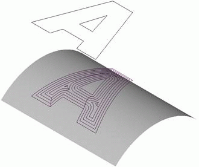
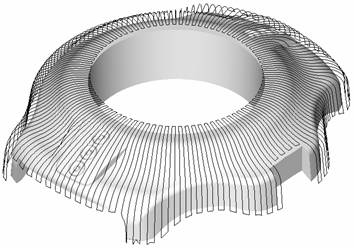
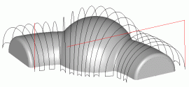

# Drive finishing operation

The drive finishing operation is best used when machining separate areas of a model with complex prelate curvilinear surfaces. It is recommended for remachining areas of a model of a specific shape, for machining of some models with slightly changing surface geometry, and also for milling of inscriptions and drawings on the model surface. When using the drive finishing operation for machining of flat areas of a models surface, it is recommended to use the outer edges as the leading curves and the along curve strategy. When machining steep areas use the across curve strategy with the same leading curves.

For every geometrical object or a group of objects, an additional stock can be defined, which during machining will be added to the main stock for the operation.

If a workpiece and a restricting model are not defined, then the system performs machining of the entire available surface of the model being machined. Otherwise only those surface areas will be machined, which lie within the workpiece and outside the restricting model.

The workpiece can be assigned as a cube, cylinder, a mould with stock or prismatic form, as residual material after machining by previous operations, and also as a free-form geometrical model, consisting of solid bodies, surfaces, meshes and prisms whose bases are projections of closed curves. In the restricting model, solid bodies, surfaces and meshes which are required to be controlled during machining, and also machining areas and restricted areas, defined by projections of closed curves can be defined.

As with the plane operation, machining of the surface of a volume model is performed using separate paths. Depending on the operation parameters, the paths lie either in the vertical plane (across leading curves) or in vertical mathematical 'cylinders', the shape and location of which are defined by the drive curves (along leading curves). The step between neighboring work passes can be either permanent or calculated regarding the defined height of the scallop.

When using a local coordinate system or a rotary axis, the position of the model being machined will not change, the tool rotation axis is parallel to the Z axis of the local coordinate system, and all work passes are located in planes or mathematical cylinders, perpendicular to the horizontal plane of the local coordinate system.

The areas of the surface model being machined can be limited depending on the slope angle of the normal to the Z-axis. If for example, the user needs to machine flat areas that have a slope angle to the surface normal of less than 30 degrees, then it is advised to set the values for the minimum and maximum slope angles to 0 and 30 degrees accordingly.

In order to machine only areas that have a small deviation from the normal to the plane of the work pass, it is advised to limit the frontal angle. For example, if one needs to perform machining of surface areas that are nearly perpendicular to the surface of a work pass, then it is advised to set a smaller value for the frontal angle (e.g. 5 degrees).

It is also possible to restrict machining from entering areas of the restricting model and areas of edge rounding in the resulting toolpath.

Joining of the work passes into a single toolpath can be performed going downwards or upwards. Transition between neighboring work passes can be performed on the surface, using retract and approach moves or via the safe plane.

