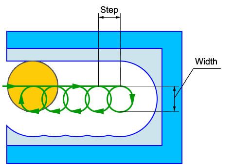

# Trohoidal machining (Equidistant legacy)

High speed cuts is formed by the adding an additional circles to the tool path. This method allows to reduce the NC data much in comparison with the trochoid and at the same time secure the tool.

The width and the step of the high speed cuts path depends on the **High speed cuts** modes. CAM system gives 4 modes:

1. **Do not use**. With this mode the additional circles will not formed in any case.

Attention: If the pocket step more than the half of the tool diameter or smooth radius is assigned then unmachined islands can be remained. It is obligatory to make the visual check of the tool path in the **Simulation** mode.

1. **For islands removing only**. The mode generates the minimal quantity of the additional circles. The circles diameter is minimal and enough to remove the islands. The cuts step is equal to the tool diameter;
2. **With pocket step**. The mode guarantees the uniform tool load. The radius of the additional circles can not be less than the smooth radius. The step of the cuts is less or equal to the pocket step. The mode is recommended for high speed machining;
3. **Reduce on the cleanup**. The high speed cuts tool path is generated similarly to the third mode but the cuts step on the cleanup is equal to the cleanup step to reduce the tool vibration;

Attention: If machining step great then half of tool diameter or tool have corner radius, then can be rest of material islands. You must visually check this machining at **Simulation** mode.
