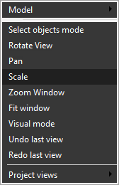

# Interactive zoom in and out

Rotate the <strong>[Mouse Wheel]</strong> to zoom. You can also use <strong>[Ctrl] + [Right Mouse Button]</strong>, then drag on the main visualization screen to zoom.

An alternative method is to activate Scale mode from the context menu of the graphic window.

Then, click and hold the <strong>[Left Mouse Button]</strong> while moving the pointer vertically in the graphic window to dynamically zoom in and out. Moving the pointer horizontally in this mode does not affect the image.
