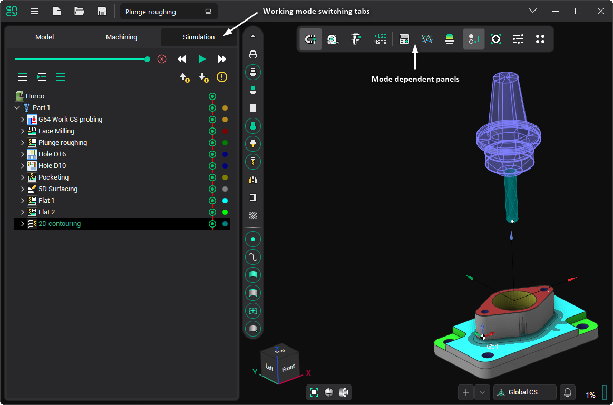
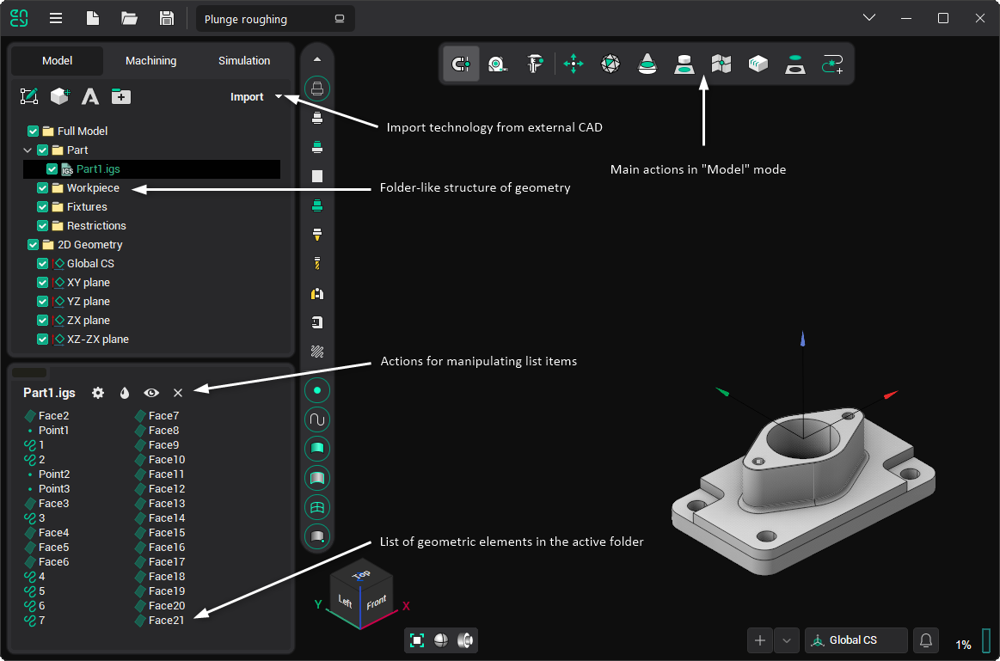
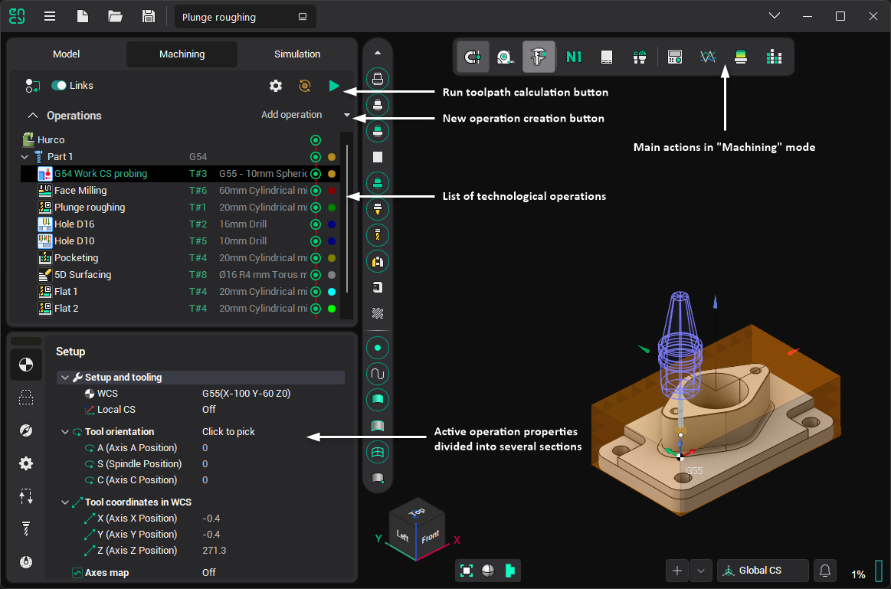
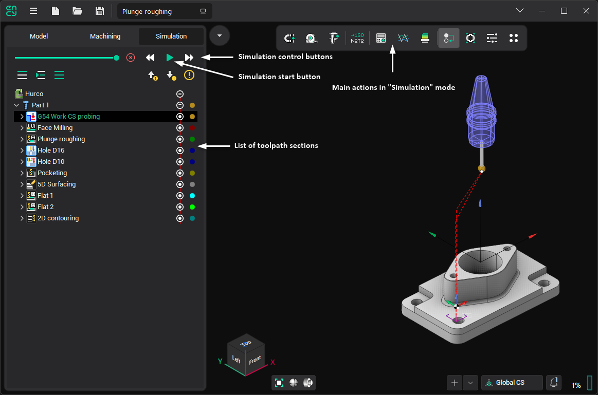

# Work modes

For convenience, the system interface is divided into several working modes. Tabs are used to switch modes in the main window. When you change a tab, the contents of the panels in the main window change:

- <strong>Working mode content</strong> <strong>page</strong> on the left side of the window.
- <strong>Working mode toolbar</strong> in the middle of the top window pane.

As a result, the number of buttons displayed simultaneously on the screen is significantly reduced, simplifying the interface and expanding the space for primary work. The sequence of tabs approximates the order of basic user actions when working on a project, though the relationship is not strictly linear.

The following briefly describes the purpose and appearance of the window for each mode.

## Model

In [Model mode,](717.md)the user can: [import](109.md) geometrical data (CAD) files, modify (cut, delete etc.) the [structure of a geometrical model](718.md), [spatially transform](116.md) (move, rotate etc.) objects, generate new elements ([copy](10058.md), [draw](833.md), [intersect](289.md), [triangulate](619.md), etc.) from existing ones, and manage the object's [visual properties](57.md).

## Machining

In [Machining mode](10064.md), the user creates the machining process for the part, choosing from [a list of available technological operations](95.md). The operation determines the processing strategy and type of toolpath. Fine-tuning of all machining operation parameters and [calculation of the toolpath](12.md) can also be performed here. After receiving the toolpath, it can be viewed on the screen, along with the [preliminary result of machining](322.md). After debugging the process, you can run the [postprocessor](730.md)to [generate the NC program](69.md) and[machining report](13.md).

The structure of the <strong>Machining</strong> mode can be studied in [this section](1020.md).

## Simulation

In [Simulation mode](10286.md), the user has access to integrated machining simulation tools that allow controlling material removal, machine collisions, and visualization parameters dynamically, and checking the generated toolpath by blocks.

Several buttons are common to both <strong>Machining</strong> and <strong>Simulation</strong> modes.

-  [Machine Control Panel](10008.md): allows you to view and modify the current values for all machine/robot coordinates.
-  <strong>[Graph of the axes](10010.md):</strong> displays changes in each machine axis over time during the toolpath execution of the current operation. This helps identify unfavorable toolpath segments with bouncing that could lead to vibrations.
-  <strong>[Verify Compare](10006.md)</strong>: allows you to display the difference between the original part and the machined result using a color scheme, where each color represents a specific deviation range between the compared elements.
-  <strong>Tool Reach Inspector</strong>: this panel allows viewing zones of the part where the toolholder does not have collisions and determining the best angle for part processing.
