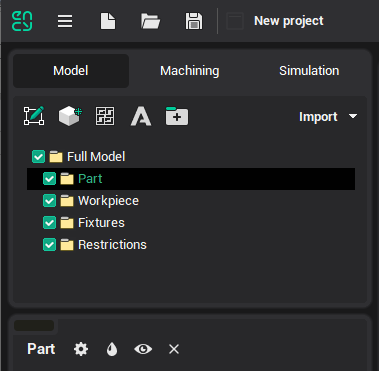
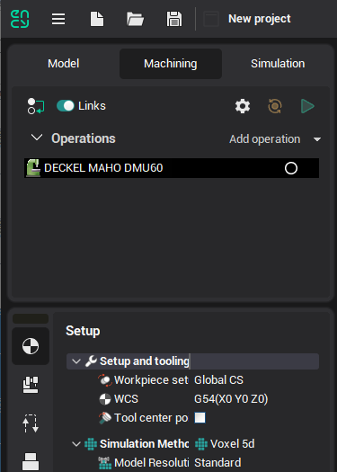
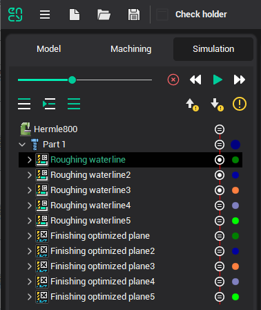

# Fast familiarization with the system

Do the following actions to compute a toolpath and generate an NC program in a short time. The typical action sequence allows you to quickly get to know the CAM system.

- Set the [working mode](86.md) to **Model** by selecting the tab sheet with the same name on the main panel.

- [Import a model](109.md) from the geometrical data exchange file. To do so, just click the  button and select the file you want in the window. The model will be imported into the active folder. Therefore, before the import starts, please activate the `Full Model/Part` folder for the part model import, `Full Model/Workpiece` for the workpiece and `Full Model/Fixtures` for fixtures etc. It is recommended to make all modifications to the geometrical model before defining the machining sequence, as the default parameter values are chosen according to the part and workpiece at the moment of operation creation.

- Set the [working mode](86.md) to **Machining** by selection of the corresponding tab sheet on the main panel:

- Check [the machine type and its parameters](341.md); edit them if it is necessary. The available operation set depends on the machine type. For example, lathe operations only are available for the lathe machine, milling operations only – for the milling machine, but both operation types can be applied for a turning and milling center.

- [Form the **Part** the **Workpiece** and **Fixtures**](294.md) for the root node of the operations list if the model definition demands of some addition constructions. It is possible to make prisms and bodies of revolution that are based on curves and references items (box or cylinder that is circumscribed on the part for example) in addition to the imported models.

- Create a new operation (or several operations). To create an operation, press the  button and select the new operation type in the opened window. The newly created operation will be added into the **Machining** folder of the root node. The new operation is set as current, and it is ready for editing and execution.

- Define the operation's parameters. When creating an operation, the program sets [Part](330.md) and [Fixtures](10283.md) as references to the models of the same name from the previous operation. The references for the first operation are to the root node models. [Workpiece](738.md) is set as a reference to the material that remained after the previous operation of machining. [Job assignment](301.md) is the full part as default. CAM system automatically defines all other operation parameters according to the foregoing geometrical data. In many cases, the new operation can be immediately executed. You can check or alter operation parameters on the panel in the bottom-left side of the main window or in the windows that are opened by the **Parameters** button click.

- Start operation execution by clicking on the  button. On the process indicator, you will see how much of the calculation has already been completed. By clicking within the indicator area, you can stop the process.

The toolpath calculating rule is to machine the [Job assignment](301.md) by the defined strategy with control of the [Part](330.md) and [Fixtures](10283.md). Roughing operations remove all covering material of the [Workpiece](738.md) to do that. The workpiece checking is optional for all finishing operations. If the workpiece is taken into account then toolpath appears for the job assignment areas where the rest material of the workpiece presents else, this one appears for the whole job assignment.

- You can estimate the machined piece by enabling [Machining result visibility](322.md)  on [Visibility panel](359.md).

- Check the obtained toolpath block by block in [Simulation](10286.md) [mode](86.md). Select the corresponding tab sheet on the main panel and click on the  button to start the simulation process. If it is necessary, then change operation parameters and recalculate them.

- Run the [Postprocessor](69.md) by the  keystroke at Machining mode. The postprocessor window will be opened. Select a CNC system (choose postprocessor file with the *.sppx extension) and click the **Run** button. You can see the NC program name in the **Output file** field. As default, the file has a name of the current project and an extension that is set in the selected postprocessor.

- Save the project by clicking on the  button of the [main toolbar](51.md). You can select the project save mode by the slider position. The project size will be bigger if the saved data is more detailed.

- You can load a previously created project by clicking on the  button on the [main toolbar](51.md).
