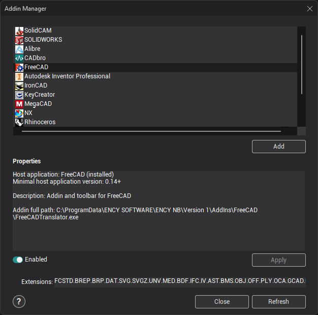
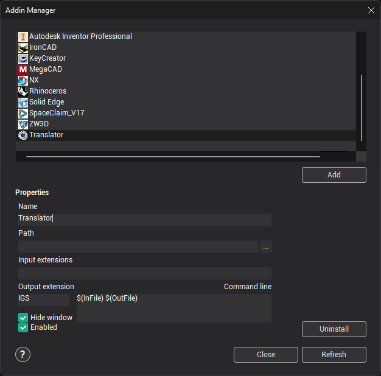

# Addin Manager

Addin Manager is a program designed to control CAM system [addin's](10039.md) and external CAD translators.

You can run Addin's Manager from CAM system- use menu item on main panel.

Addin Manager window:

Addin's

Work sequence to install addin:Select necessary addin from the top list. Press **Install** button. Edit parameters (custom). Press **Apply** button to save changes (custom). Press **Close** button (custom).

Work sequence to uninstall addin:

Select necessary addin from the top list. Press **Uninstall** button. Press **Close** button (custom).

Before installing\uninstalling the toolbar must be closed system for which this panel will be installed, this will inform the installer. If you do not, then the installing/uninstalling will be canceled.

Addin's are listed in the top list. When one of them is selected then additional information on the **Parameters** panel is displayed. Usually, it is a name and version of application addin works with; description of addin abilities, etc. Editable parameters (if exists) are on this panel too.

If addin was already installed then it can be switched on/off without changes lost of it's default parameters by the **Enabled** checkbox (sequence of buttons **Uninstall** **Install** will reset all changes and as a result addin will be installed with parameters by default).

Field **Extensions** illuminates if only a selected addin supports misc manipulation with files with specific extensions (types), for example file import. In this sample, the user could edit file types which will be imported by addin selected.

**Default** fills properties, by default, for the selected addin. For example if file extensions were changed then press of **Default** resets its as default values from addin.

**Apply** saves changes for the selected addin.

**Install** / **Uninstall** – registers/unregisters selected addin for a work.

**Close** – closes CAM system Addin Manager. If there were changes then `Save/No/Cancel` dialog will be shown.

**Refresh** – rereads all addins. Note: all changes will be lost.

**Help** – displays this help. In some cases there is a need to reload application (addin host) when addin properties are changed. For example after installation of the CAM system toolbar for SOLIDWORKS® ' addin SOLIDWORKS® should be reloaded. All addin's must be in the 'Addins' folder (the folder for CAM system Addin Manager) and/or its subfolders. CAM system Addin Manager scans those folders to look for addin's and lists its. That is enough to place any addin (from CAM system or from any other source) to those folders and it will be accessible for CAM system Addin Manager (press **Refresh** button if CAM system Addin Manager is run).

External CAD translators

You can use the Addin Manager to plug external CAD translators. A CAD translator is a program which is able to convert one file format (e.g. CATIA, Pro/E, NX etc. ) into another native CAM system formats (e.g. IGS, STL, 3DM etc.) and supports the command line interface (e.g. you can type convert.exe Model.CATIA Model.IGS in a command line and the translator will generate an IGS file from the CATIA file). After registering a cad translator in the Addin Manager you will be able to seamlessly import the cad files supported by the translator into CAM system.

So, to add an external CAD translator into CAM system you shouldOpen the Addin Manager Click on the **Add** button. Fill the parameters of the translator.

The parameters are the following:**Name** - This name will be appeared in the Import dialog in the list of supported formats (e.g. Translator1 (external) (.model.ipt) **Path** - This is the full path to the translator executable. You can fill this field by pressing the ellipses button next to the text box and navigating to the executable using the standard windows file explorer. **Input extensions** Here you should enter the input file extensions supported by the translator. The extensions must be dot separated. E.g. model.ipt.step.sat. **Output extension** - In this field you have to specify the output file extension of the translator. It must be one of the CAM system natively supported formats, e.g. IGS, 3dm, STL, STEP, X_T. **Command line** - In this box you should specify the command which will be passed to the translator. Use the $(InFile) macro instead of the input file name, and the $(OutFile) macro instead of the output file name. E.g. -i $(InFile) -o $(OutFile)
