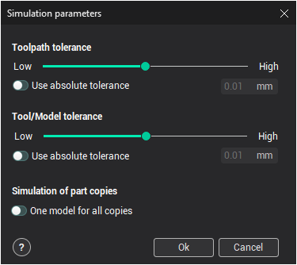
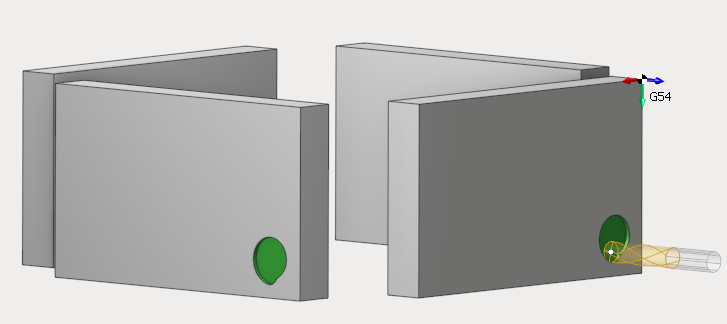

# Assigning workpiece parameters

The simulation settings editing window opens when the  button in the machining [simulation window](352.md) is pressed.

The tolerance of simulation may be specified either using the slider that ranges from **Low** to **High** or in absolute units, if the **Use absolute tolerance** box is checked. The chosen tolerance affects the tool, the initial workpiece and the toolpath. The lower the value is the faster simulation runs but lower the quality of a resulting model is. By default the relative value specified with the slider is used. In this case the actual absolute tolerance values for the tool, the workpiece and the toolpath are chosen automatically according to their extents. This guarantees a good result for most workpieces and toolpaths. However one can to set the common exact tolerance value to guarantee reliable result in hard cases.

The used tolerance value can be modified dynamically while simulating a toolpath. So most interesting fragments can be simulated with higher tolerances.

The **One model for all copies** parameter is really useful when you work on a project with many copies of a part. This parameter allows to use less RAM and as a result to speed up the simulation process.

<em><strong>Notice</strong>:</em>

- <em>We do not recommend you to use high tolerance for simulation on low-end computers</em>
- <em>If you made any changes in this window, you should reset workpiece parameters on simulation page, by clicking the reset button</em>
