# Creating new operation

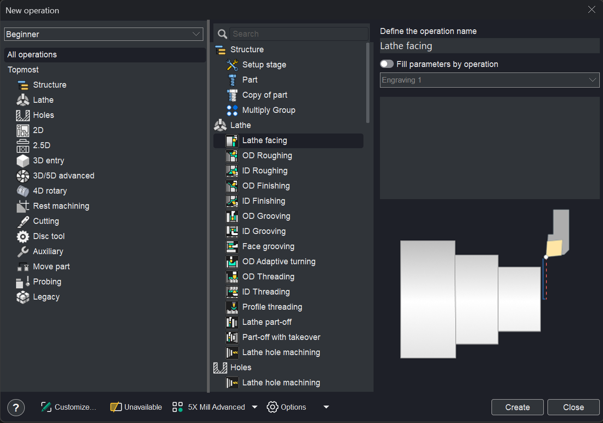

## Application area:

To add a new machining operation to the technical process, CAM system provides a dedicated creation window where you can browse, search, and configure operations before adding them to your project.

There are two ways to work when creating an operation:

- The first one is more suitable for beginners who are getting familiar with the system.

Click here to expand..

To open the window for creation a new machining operation just press the  button.

After that, the operation creation window will appear. This mode is preferable for new users, as it allows them to view the operation details.

There are two ways to create an operation in the window.

- By double click of the left mouse button on the operation in the technical process, an operation of the appropriate type is adding. Thus creation operation window remains open.
- In order to create an operation select it in the list and click on the "Create" button, the operation will be created and the window will be closed.

- The second one is intended for more experienced users.

Click here to expand..

There is also one more quick and easy way to create a new operation. To create an operation, you can click the arrow next to  and choose from the menu the desired type of operation.

This method of creating operations significantly accelerates the work, as it eliminates the need to constantly open and close the windows.

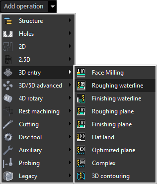

The creation window is divided into three panes:

- <strong>Left pane</strong> — lists operation groups for category selection.
- <strong>Middle pane</strong> — displays the operations belonging to the selected group.
- <strong>Right pane</strong> — shows details about the currently highlighted operation.

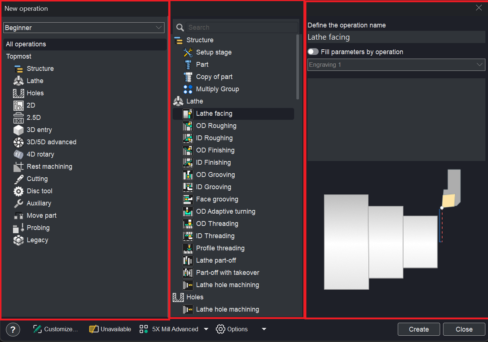

### Right pane.

This panel presents details for the selected operation and supports the following capabilities:

<strong>Operation name specification.</strong> The name can be defined using the <strong>Define the operation name</strong> field.

<strong>Settings copying from an existing operation.</strong> Enabled via the <strong>Fill parameters by operation</strong> checkbox; the source operation is selected from the dropdown list.

<strong>Explanatory image with video playback.</strong> located at the bottom of the panel; a single click toggles video playback.

### Toolbar.

The <strong>bottom toolbar</strong> provides functionality for managing the content displayed within the window. It comprises the following elements:

<strong>Question button.</strong> It allows you to open the help section for this topic.

<strong>Customize...</strong> Customize which operations and groups should be visible in this window and in <strong>Create operation</strong> dropdown menu.

Click here to expand..

The updated window layout introduces enhanced controls for managing operations and groups, as detailed below:

- <strong>Additional controls adjacent to operations and groups</strong> — new buttons and checkboxes are displayed next to the names of operations and groups. The checkboxes govern the visibility of the corresponding operations and groups within the interface.
- <strong>Drag-and-drop functionality</strong> — operations can be repositioned between groups via drag-and-drop interaction.
- <strong>Group creation and deletion</strong> — new groups can be created, and existing groups can be deleted by using the dedicated buttons located in the upper section of the window.
- <strong>Group name modification</strong> — the name of any group can be edited by clicking on it and entering a new label.
- <strong>Group repositioning and nesting</strong> — groups can be moved to alternative locations within the hierarchy or nested inside other groups using drag-and-drop operations.

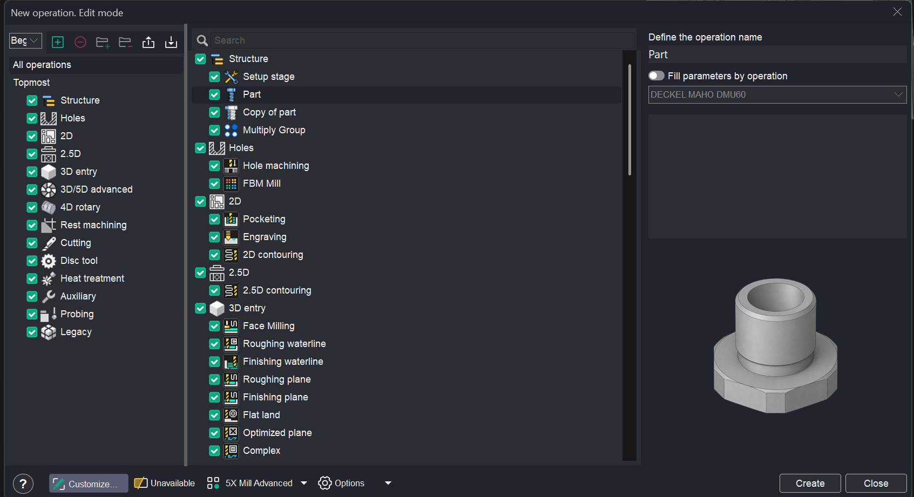

<strong>Create configuration.</strong> Adds the new configuration, all properties are copied from the current configuration.

<strong>Remove configuration.</strong> Removes current configuration. Last configuration in the list can not be removed.

<strong>Add group.</strong> Add new group of operations. Use it to create a sub-menu in "Create operation" dropdown menu. Click to a group to change its name. You can drag operations to any group.

<strong>Remove group.</strong> Remove selected group of operations.

<strong>Export current configuration.</strong> Export current configuration to external file. A ZIP archive will be created. The <strong>User defaults</strong> in the Inspector will also be exported. [Details](100159.md)

<strong>Import current configuration.</strong> Import current configuration to system.

<strong>An example of creating your own configuration.</strong>

First, you need to create a <strong>new</strong> <strong>configuration</strong>. The name "New Configuration" will appear in the configurations window.

Disable all groups.

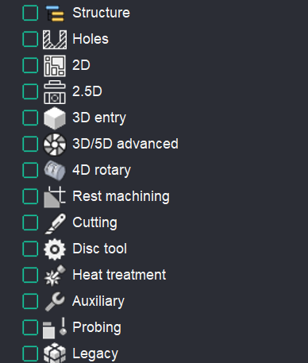

Use the <strong>Add Group</strong> function on the toolbar to create a custom group. Name it "Mill Quickly".

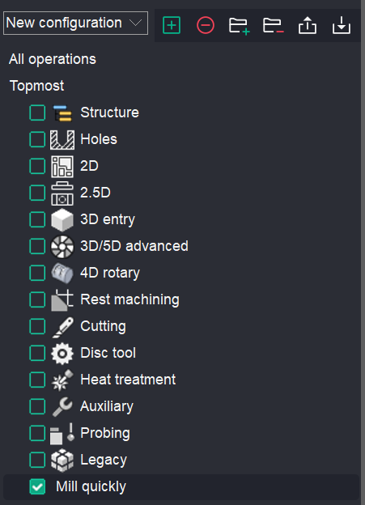

Drag and drop a set of operations into this group.

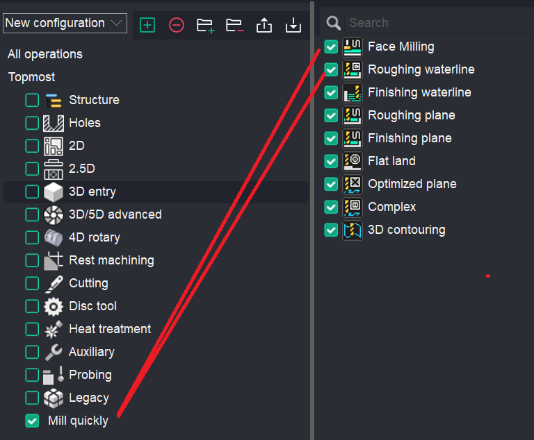

You can click the <strong>Customize…</strong> button. Your configuration with the operation group will be displayed in the <strong>operation creation window</strong>.

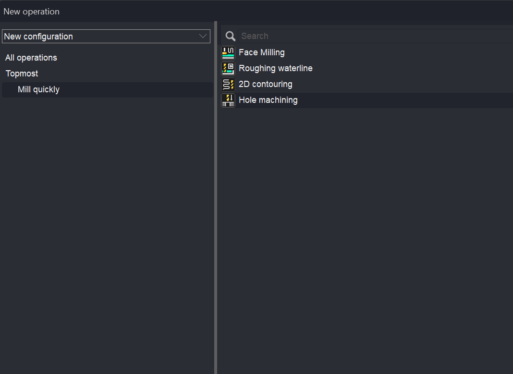

Also in the dropdown list.

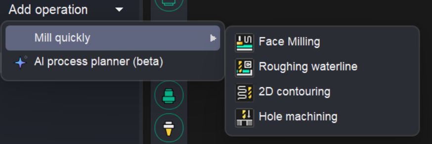

You can rename the configuration.

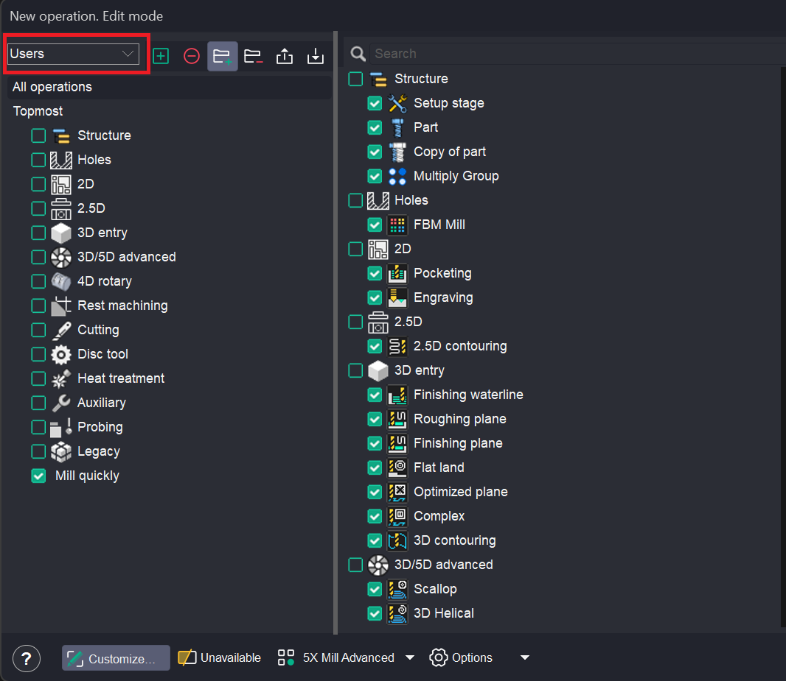

<strong>Unavailable.</strong> Show operations which are currently unavailable. Operations may be unavailable due to the machine type or license availability.

Click here to expand..

The reason why an operation is unavailable is displayed in the right‑hand panel.

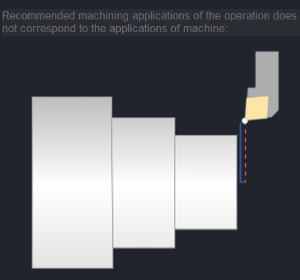

<strong>Operation preset.</strong> Show operations preset for machining. ( Express, Cutting, Cutting 5D, 2.5X Mill, 3X Mill, 3X Mill Advanced, Rotary, 5X Mill, 5X Mill Advanced). Depending on the selected preset, the groups and set of operations will change.

<strong>Options.</strong> It allows you to activate the options.

Click here to expand..

Among the available options, there is a <strong>3+2 mode</strong> option.

If the user has a license (e.g., 3X Mill Advanced) and this option is enabled (<strong>ON</strong>), the operation will be created with the <strong>Local CS</strong> parameter visible on the <strong>Setup</strong> <strong>tab</strong>. [Details](1022.md) This enables machining in 3+2 mode.

If the option is disabled (<strong>OFF</strong>), the <strong>Local CS</strong> parameter will not be displayed.

This option also affects the following parameters:

- <strong>Approximate safe motions;</strong>
- <strong>Safe surface (Cylinder, Sphere);</strong>
- <strong>Rotary Transformations.</strong>

