# List of types of machining operations

The following is the current list of operations implemented in the current version of the CAM system.

| <strong>[Structure](1023.md)</strong> |   |
|---|---|
| [Setup stage](1024.md) |   |
| 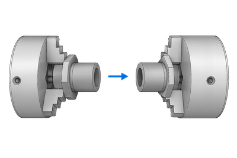 | This group is designed to define the stage of the manufacturing process where the part remains in a fixed position. It allows the part to be machined from different sides, while previous setups do not interfere with subsequent setups by hiding the part, workpiece, and other objects from previous setups. Within this group, you can add fixtures that will be considered in subprojects (Part, Copy of Part). |
|   |   |
| [Part](1025.md) |   |
| 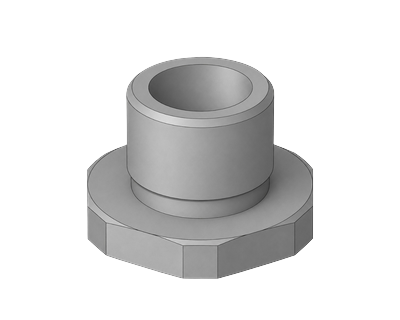 | This group is used to create multi-component projects: several different parts or standard parts, divided into operations based on technology (similar to a conveyor belt). The Setup tab in this group is used to configure the main project parameters, such as part positioning on the equipment, the part coordinate system, etc. A set of transformations for converting toolpath coordinates is also available for this group. |
|   |   |
| [Copy of part](1026.md) |   |
| 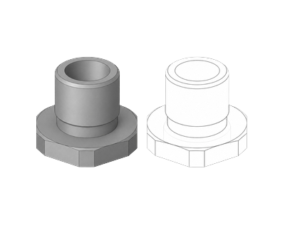 | A special type of group designed for preparing a project with several identical parts. The workflow typically follows this: a prototype Part with the required operations is created; then a Copy of Part is created, which uses the prototype as a template. Copies are synchronized with the prototype — operations cannot be added or deleted within a copy: when an operation is created or deleted in the prototype, corresponding copies of the operations are automatically created or deleted in all copies. Copy operations do not calculate the toolpath themselves, but apply the prototype's toolpath to the copy's position; resetting the prototype calculation requires manually recalculating the copies. For copying, output can be configured via subroutine calls (if the postprocessor supports it). The Setup tab in Copy of Part is used to specify the position, workpiece, and coordinate system for the copy. |
|   |   |
| [Multiply Group](1027.md) |   |
| 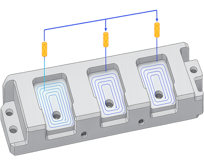 | A group that defines the methods for copying paths; these rules are then inherited by operations within the group. This allows operations to process individual features of a part, while the group itself automatically propagates the results to all standard features according to the defined rules. Copying is performed according to the rules in the Transformations tab. |

| <strong>[Lathe](10175.md)</strong> |   |
|---|---|
| [Lathe facing](307.md) |   |
| 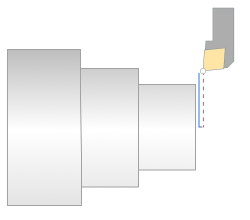 | The <strong>Lathe Facing</strong> operation is designed to prepare the uneven end surface of a workpiece (left or right). Material is removed layer by layer using vertical tool movements. It automatically generates a toolpath for machining the end surface based on the current workpiece and part. The operation is used for both roughing and finishing and is often applied before drilling or other turning cycles. |
|   |   |
| [OD Roughing, ID Roughing](316.md) |   |
| 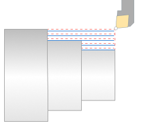 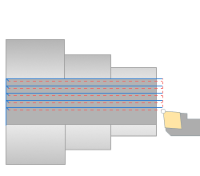 | The operation is designed for the removing of the sizeable part of the workpiece. It can be used when the workpiece is much different of the part. The material is removed by the series of the parallel tool motions. The operation provides to remove a lot of workpiece volume in the shortest time. |
|   |   |
| [OD Finishing, ID Finishing](310.md) |   |
| 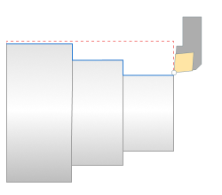 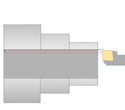 | The operation is designed for the final finishing machining. The machining is performed by the offset motions along the part generatrix. It gives the best result if the part and workpiece have the little differences. The operation allows to generate the toolpath without the workpiece checking. It is also possible to make [4-axis turning](10202.md) |
|   |   |
| [OD Grooving, ID Grooving, Face grooving](312.md) |   |
| 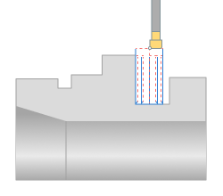 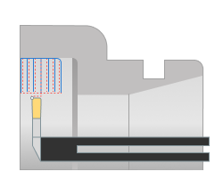 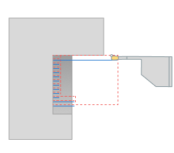 | The operation is designed for the groove machining and other zones that can not be machined by other lathe operations. The cycle generates the tool path according to the groove tool possibility to cut by the front side. The tool path can combine the rough path for the workpiece volume removing and finish path for the shaping. The workpiece volume can be removed by some layers with the different strategies and cutting directions. There is the possibility to switch on the chip breaking and delays. |
|   |   |
| [OD Adaptive turning](10205.md) |   |
| 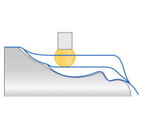 | An adaptive roughing turning operation that generates an optimized, smooth toolpath while maintaining a constant tool load. This increases tool life and significantly increases cutting speed (the process is more than twice as fast as traditional grooving). The operation uses an Adaptive strategy, similar to the Roughing Waterline strategy, and is designed for tools with round inserts. |
|   |   |
| [OD Threading, ID Threading](319.md) |   |
| 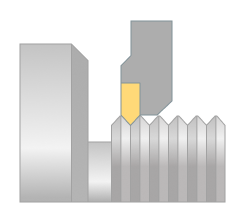 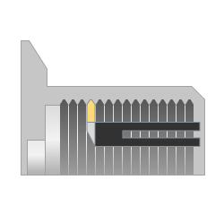 | The operation is designed to make the different threads by turning cutter or thread chaser. There is the possibility to select the thread parameters from ISO or Imperial databases. The thread parameters can be set manually to make the special threads. The machining can be performed in few strokes. Different types of the approach engage retract and return are available |
|   |   |
| [Profile threading](10199.md) |   |
| 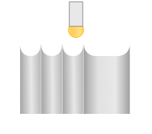 | The <strong>Profile Threading</strong> operation allows you to form threads with a profile shape different from the tool's shape. Material is removed from within the entire thread groove in a series of sequential passes—the placement of the passes is calculated based on the tool's shape and the shape of the thread groove. |
|   |   |
| [Lathe part-off](313.md) |   |
| 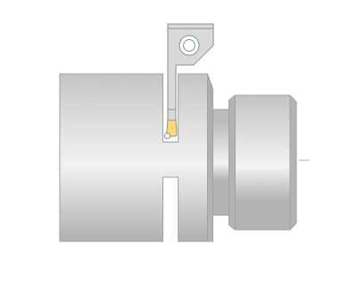 | The operation cut out the part with the additional chamfer or rounding machining. The size of a groove, the chip breaking parameters and the delay values can be set. |
|   |   |
| [Part-off with takeover](1060.md) |   |
| 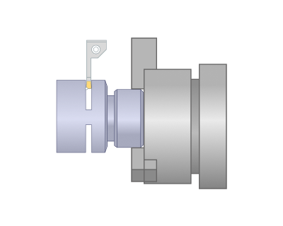 | The <strong>Part-off with Takeover</strong> operation is designed to cut a machined part from a remaining workpiece while simultaneously forming the end face (including chamfering or rounding). The area for cutting can be prepared in advance (for example, by cutting a groove). It differs from a standard Lathe part-off in that, upon completion of the operation, the workpiece is transferred (takeover) to another spindle. |
|   |   |
| [Lathe hole machining](10176.md) |   |
| 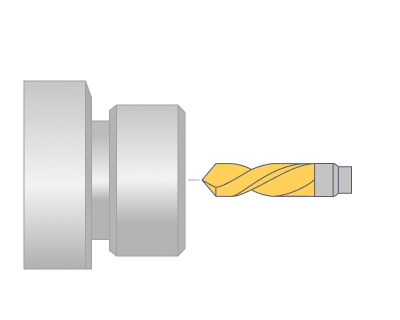 | The operation is designed to generate the NC commands to machine the axial holes. The next cycles are supported: simple drilling, deep drilling with chip breaking or removing, threading by tap etc. There is the possibility to set the cycle output mode: Long hand or canned cycle. |

| <strong>[Holes](100168.md)</strong> |   |
|---|---|
| [Hole machining](10100.md) |   |
| 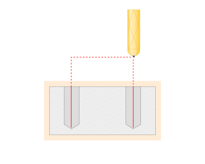 | Creates a set of machining commands for holes. These include drilling, boring, centering, tapping or thread milling. The operation can be used both for hole machining and for preliminary drilling in tool plunge points in pocketing and waterline roughing operations. Hole machining operation can be used to machine holes that are positioned differently, i.e. holes whose axes are not normal to the same plane. Note that operation can machine holes that are not lying in orthogonal planes. |
|   |   |
| [FBM Mill](10089.md) |   |
| 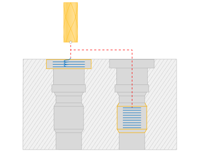 | When creating an FBM Mill, the team automatically recognizes known manufacturing features in a part and allows you to select predefined or saved machining procedures from the FBM Procedure Library. The system automatically generates the necessary operations for the identified features and organizes them according to current rules (for example, minimizing tool changes). |

| <strong>[2D](100169.md)</strong> |   |
|---|---|
| [Pocketing](256.md) |   |
| 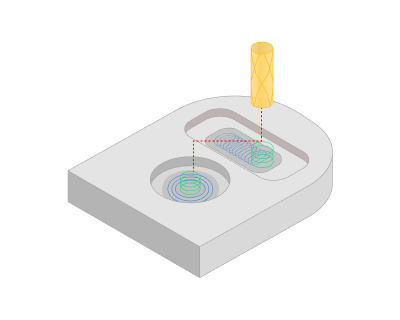 | Waterline removal of material inside the defined area or pocket. The shape of the area for pocketing is formed from curves created on the horizontal (XY) plane. This operation is used for the 2 & 2.5D machining of pockets and isolated areas, and also for preliminary material removal before engraving (2D finishing) operations. |
|   |   |
| [Engraving](810.md) |   |
| 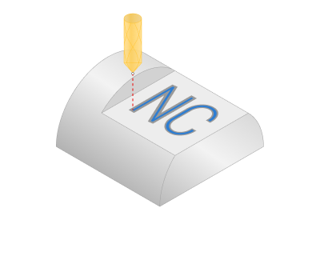 | The operation is designed for the engraving of 2D geometry and inscriptions on flat areas. The image being engraved is formed from projections of curves onto the horizontal (XY) plane. Horizontal movements of the tool machine the main parts of the model's side edges. To create the sharp inner corners and for machining of smaller width areas, 3D milling is used. The operation is used for engraving of flat drawings and inscriptions and for finishing passes along side walls of pockets and for isolated areas during 2 & 2.5D machining. |
|   |   |
| [2D contouring](404.md) |   |
| 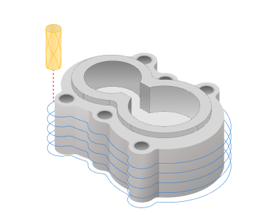 | For the machining of horizontal contours or curves projected onto the horizontal plane. The horizontal movements of the tool are created based on the geometry being machined. The tool center or the tool edge can follow the contour. The operation is used for creating parts with vertical sides or for a machining pass with a constant Z depth etc. |

| <strong>[Basic](100170.md)</strong> |   |
|---|---|
| [Face milling](10117.md) |   |
| 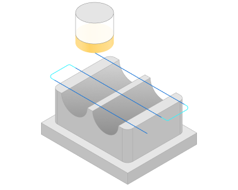 | <strong>Face Milling</strong> operation removes stock on a given horizontal plane with one of the following strategies: One way, Zigzag, Optimized zigzag, Spiral. |
|   |   |
| [Roughing waterline](736.md) |   |
| 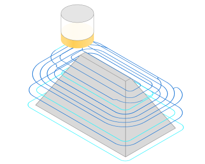 | Waterline removal of stock material of a workpiece, which lies outside the 3D model. As in pocketing, the main part of the material is removed by the horizontal (XY) movements of the [tool](https://confluence.encycam.com/display/SC1/.Tool+v18). The operation is often used for primary rough machining of complex models, which have considerable geometrical difference to the workpiece. |
|   |   |
| [Finishing waterline](841.md) |   |
| 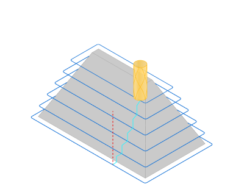 | Waterline machining of surfaces of a volume model. Milling is performed by using horizontal movements of the tool. The operation gives a good result when machining models or their parts with their major surface areas that are close to the vertical. For machining of models of high complexity, it is recommended to use the waterline operation together with plane or drive. |
|   |   |
| [Roughing plane](735.md) |   |
| 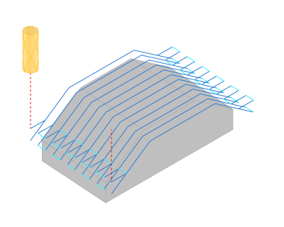 | Plane removal of stock material of a workpiece, which lies outside the 3D model. The sections lie in vertical parallel planes. To limit the pressure on the tool, machining can be performed with small preset Z depths. The finished operation is usually closer to the finished model than using the waterline operation with similar parameters. The operation is normally used when it is necessary to obtain a roughed workpiece that does not differ much from the source model. It is also useful when milling soft materials. |
|   |   |
| [2.5D contouring](10115.md) |   |
| 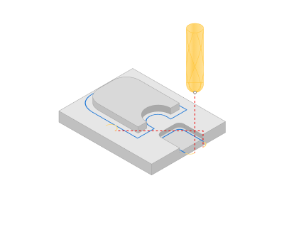 | The <strong>2.5D contouring</strong> operation expands the capabilities for processing multi-level part contours. The operation works with a model composed of flat regions bounded by closed profiles at different heights; machining is performed through a series of horizontal passes (layers)—the number of passes and their Z-levels are determined by the working levels and step in the operation parameters. |
|   |   |
| [Flat land](759.md) |   |
| 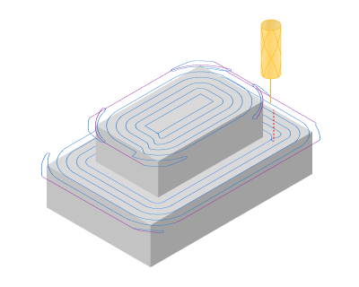 | The operation allows to make a finish machining of flat horizontal surfaces of a part. The flat segments are recognized automatically. A tool toolpath consists of series of horizontal patches. All not horizontal segments of model for machining are inspected to avoid gouges during machining. |
|   |   |
| [3D contouring](700.md) |   |
| 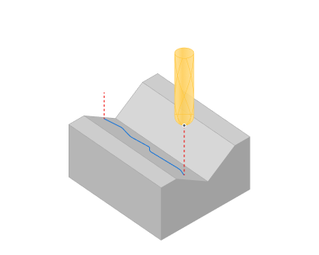 | Generates a series of tool movements along freeform curves. The view of the toolpath in plane is similar to 2D contouring – tool movements are constructed with the tool center or edge passing along the contour. The Z coordinate at every point of the toolpath is calculated as a displacement based on the Z coordinate of the corresponding point on the curve. The operation can be used for machining of edges of parts of a die or for creation of a complex shaped groove etc. |

| <strong>[Advanced](100171.md)</strong> |   |
|---|---|
| [Combo finish](100126.md) |   |
| 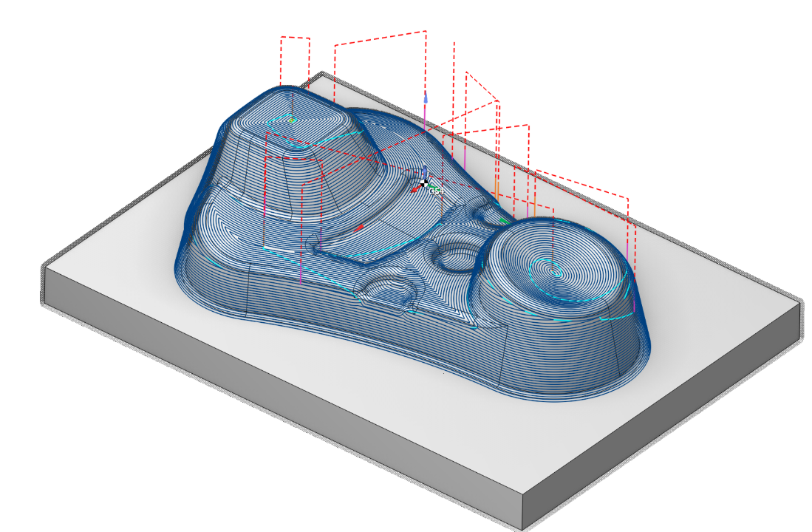 | Combines plane, waterline, and scallop finishing strategies. |
|   |   |
| [Surfacing](10135.md) |   |
| 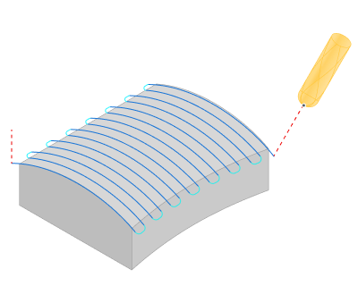 | The finishing operation allows machining of surface models with variety of strategies (parallel to plane, parallel to curve, morph and others) and tool axis orientation modes (fixed, normal to surface, to rotary axis, through point, through curve, etc). |
|   |   |
| [Scallop](10118.md) |   |
| 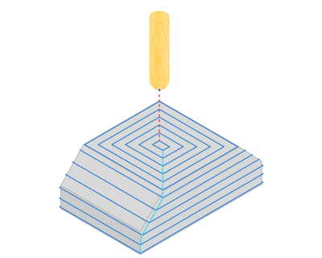 | <strong>Scallop</strong> (or 3d constant step-over) tool path starts with curves lying on the part surfaces and repeatedly offsets them inwards until the curves collapse. consistent step-over across the part surfaces is guaranteed The tool path is well suited for high speed machining of complex molds and sculptured models. Features: Lightning fast toolpath calculation. One entry, one exit. It is possible to machine a whole part with a single continuous spiral-like toolpath with only one entry and one exit points. High speed machining. It is possible to generate a toolpath with rounded corners. |
|   |   |
| [Helical](10119.md) |   |
| 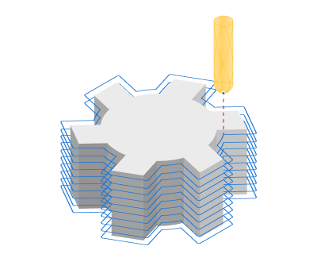 | <strong>3D Helical</strong> machining operation are useful for machining of cylindrical parts without an undercuts. The entire model is selected as the job assignment. The operation can generate a single-pass spiral like path for the entire model. If there are model areas that can not be processed without a transition, it will be processed after the processing of the current pass. The operation does not control the height of the scallop and does not ensure a uniform height change. |
|   |   |
| [Morph](10138.md) |   |
| 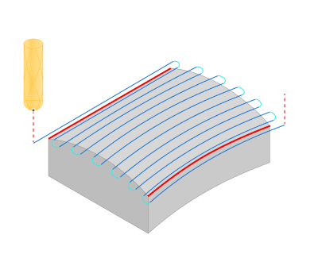 | <strong>Morph</strong> operation generates a toolpath that smoothly morphs between two specified curves with high speed links. Available strategies include: Across, Along, Spiral. 3 to 5 axis toolpath with the following tool axis orientation modes: Fixed, Normal to drive curves 4d/rotary axis/drive curves 5d/surfaces 5d. Benefits: Many operations for the machining of: turbine wheels, turbine blades, and screws, as well as complex channels etc. High speed links. |
|   |   |
| [Undercut waterline](100150.md) |   |
| 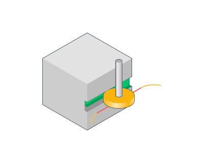 | The <strong>Waterline Undercut</strong> operation is designed to create recesses, grooves, or cavities using an undercut milling tool - it generates a waterline specifically for undercut tools. |
|   |   |
| [Swarf](1040.md) |   |
| 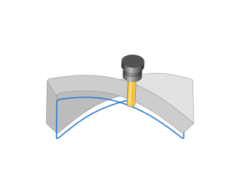 | The <strong>Swarf</strong> operation is a 5-axis operation for machining complex guided surfaces using the side face of a cutter. It is designed primarily for finishing (also supports roughing passes), allows for tool tilting (automatically or manually using vectors along the toolpath), and has two algorithms for defining the machining area: By Bottom Edge. By Two Curves. |
|   |   |
| [5D Roughing waterline](102025.md) |   |
| 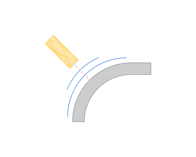 | A specialized 5-axis roughing operation for machining pockets with curved bottoms, based on the logic of the Waterline operation. The operation is assigned to "Floor surfaces" (usually the pocket bottom) and operates within a closed work zone (Job Zone). |
|   |   |
| [5D by meshes](10142.md) |   |
| 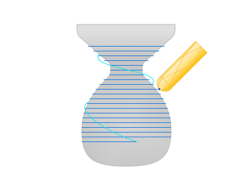 | A versatile 5-axis finishing operation for processing complex shapes and triangular meshes (mesh / STL). Suitable for finishing sculptures, scanned models, and complex surfaces, it supports Scallop, 3D Helical, and Waterline-like patterns, automatic/manual tool axis orientation, and automatic tool-holder collision avoidance. |
|   |   |
| [6D Contouring](10129.md) |   |
| 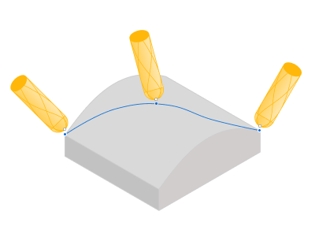 | It generates a continuous multi-wave toolpath for spatial curves and surfaces with an extended set of tool axis orientation strategies and rotational axis constraint management. |
|   |   |
| [Contour polishing](164691982.md) |   |
| 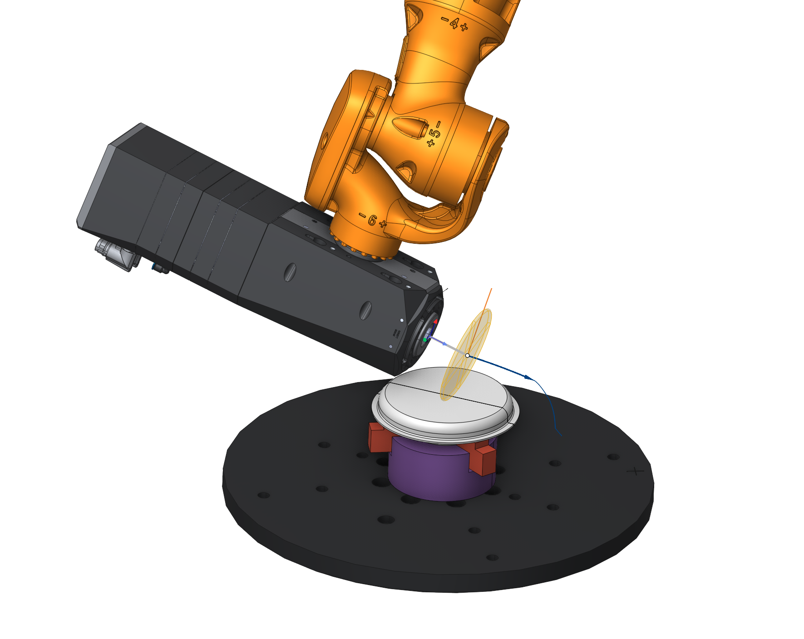 | Finishes part walls and edges along contours using a disc tool. |

| <strong>[Rotary](100172.md)</strong> |   |
|---|---|
| [Rotary waterline](10143.md) |   |
| 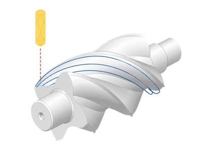 | The rotary machining operation is used for the machining of the camshafts, crankshafts, worm shafts, paddles, decorate parts and so on. This operation is available if machine has at least one continuous rotary axis. |
|   |   |
| [Rotary roughing](10137.md) |   |
| 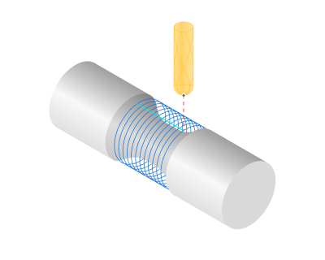 | <strong>Roughing rotary</strong> is a 4 axis toolpath that removes the workpiece material layer by layer. It is similar to the Roughing Waterline except that the machining layers are not planes, but cylinders around the rotary axis. |
|   |   |
| [Rotary finishing](10136.md) |   |
| 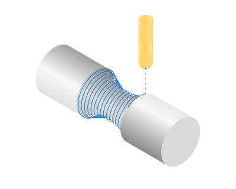 | This is a 4-axis finishing operation for machines with at least one continuous rotating axis. It is used for finishing shafts and rotating bodies (common examples: camshafts, crankshafts, worm gears, blades, and decorative parts). |
|   |   |
| [Morph 4D](10146.md) |   |
| 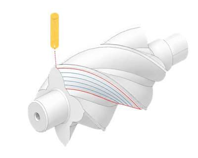 | This is a 4-axis finishing version of the Morph operation, adapted for machines with a continuous rotary axis (4x and 5x configurations). It generates a smooth toolpath between two specified curves (First/Second Curve) or between contact curves of selected Machining Surfaces, supports Sync Lines for improved morphing quality, and provides morphing strategies (Across, Along, Spiral, etc.). |
|   |   |
| [4D Surfacing](10145.md) |   |
| 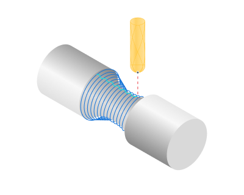 | A finishing operation adapted from 5D Surfacing for machines with a continuous rotary axis (4x and 5x configurations). This operation is designed for finishing complex surfaces with a clear rotation axis or extended along an axis: it generates surface passes, supports strategies such as Parallel to Curve, Morph Between Two Surfaces, and Spiral Between Two Surfaces, and provides control over the tool axis orientation (but disables some 5D strategies: Through Point, Through Curve, and Perpendicular to Toolpath). |
|   |   |
| [4D Contouring](10144.md) |   |
| 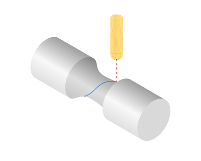 | The <strong>4D Contouring</strong> operation generates continuous toolpaths for machining spatial curves on surfaces with an explicit axis of revolution or extruded along an axis. It supports single passes along selected curves, multi-pass machining along isoparametric surface lines, and multi-level machining along a curve. |

| <strong>[Turbomachinery Milling](100173.md)</strong> |   |
|---|---|
| [Impeller Machining](1041.md) |   |
| 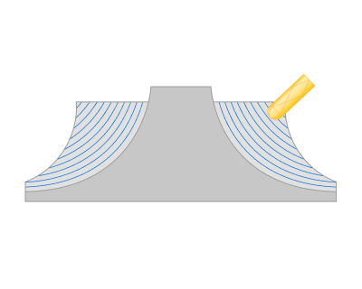 | The <strong>Impeller Machining</strong> operation is designed for efficient 5-axis machining of blisks and impellers: it includes strategies for roughing the workpiece, finishing the blades and hub, and grinding/finishing fillets. The operation supports tool/holder/workpiece collision control and allows precise definition of machining areas: Blade Surfaces, Hub Surfaces (must be a surface of revolution), and Shroud Surfaces. |
|   |   |
| [Blade Machining](100127.md) |   |
|  | Finishes blade airfoils, root zones, hubs, and edges. |

| <strong>[Rest machining](727.md)</strong> |   |
|---|---|
| [Corners cleanup](10121.md) |   |
| 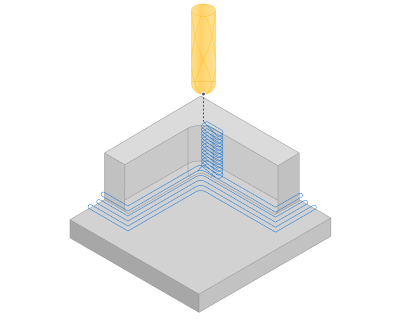 | The rest machining operation takes the diameter of the previous tool as a parameter and generates passes where the previous tool would leave unmachined material. |
|   |   |
| [Pencil](10120.md) |   |
|  | The rest machining operation generates passes along inner corners of the part. |
|   |   |
| [Chamfering](10123.md) |   |
|  | The Chamfering operation is used to create chamfers and fillets, or remove burrs along the edges of a part. It generates a toolpath for chamfering with cylindrical, conical, or ball-nosed cutters; the operation is most often used as a final step in chamfering/filleting, blunting sharp edges, and removing burrs. |

| <strong>[Legacy operations](123124.md)</strong> |   |
|---|---|
| [Finishing plane](713.md) |   |
|  | Plane machining of surfaces of a volume model. Passes lie in vertical-parallel planes. A good result can be achieved when machining flat areas and also areas close to the vertical that are perpendicular to the toolpath. Therefore, for machining of complex shaped models this operation is best used with the waterline or other plane operation, which has toolpaths perpendicular to the toolpath of the first operation. |
|   |   |
| [Optimized plane](714.md) |   |
|  | Two plane operations with mutually perpendicular toolpaths are created at a time for surface machining of a 3D detail. The default parameters of this operation are set so that every operation would machine only those surface areas of the model, where it can achieves an optimal result. This means that there will be a regular quality of machining on the entire model surface. Use of the optimized plane operation allows quality machining of models with difficult surface shapes, and also minimizes the machining time. |
|   |   |
| [Complex](839.md) |   |
|  | Two operations are created: plane and waterline for surface machining of a 3D model. Parameters for the operations are set automatically so that the flat areas are machined using the plane operation and the areas close to vertical by the waterline. As a result, there would be a proportional quality of the entire surface of the machined detail. The complex machining provides easier conditions for the tool, this allows the use of longer tools with a smaller diameter. The operation allows performing quality machining for any surface angle, and also minimizes the machining time. |

| <strong>[Cutting](10224.md)</strong> |   |
|---|---|
| [Jet cutting](326.md) |   |
|  | The operation is used to carve the parts from the sheet. The outer contours and the contour of the holes can be defined by any closed or unclosed curve. The carving is performed by the tool motion along the part contours. The holes are cut in first and the outer contour is cut later. |
|   |   |
| [4D Jet cutting](10225.md) |   |
|  | <strong>Jet cutting 4d</strong> operation can be used for hydro, laser, plasma etc. cutting types where the tool is a jet or a beam. It allows to machine simple elements and also more complex elements with inclined sides. Working contours are set the same way as in the Wire EDM operations, however, the resulting path is generated in the format of "point + normal" or "point + rotary axes of the machine." |
|   |   |
| [Jet cutting 5D](10226.md) |   |
|  | Operation <strong>Jet cutting 5D</strong> is designed for the cutting on the shaped spatial surfaces. It is based on the operation "[5D contouring](10129.md)" excluding multipass machining feature unnecessary for this kind of application. |
|   |   |
| [2D knife cutting](10241.md) |   |
|  | <strong>Knife cutting 2D</strong> operation designed to programming cutting of sheet material with the tool like knife (it can be knife, band-saw, disk-saw etc. ). A special transition formed in the sharp corners of toolpath that avoids the bendings of the material because of the sharp turn of the knife. The operation based on [2D Contouring operation](404.md). The [knife](10240.md) usage adds the additional requirements for the machine. The machine has to have, except the Linear X,Y,Z-axes, the additional rotary axis that rotates the tool around. |
|   |   |
| [6D Knife cutting](10242.md) |   |
|  | Operation <strong>Knife cutting 6D</strong> is designed for the carving on the shaped spatial surfaces. It is based on the operation [5D contouring](10129.md). A special transition formed in the sharp corners of toolpath that avoids the bendings of the material because of the sharp turn of the knife. In the every point of tool path the knife blade must be directed along the motion. It requires all 6 degrees of freedom. So active machine must have a minimum of three linear and three rotary axes. Very often the industrial robots are used for the knife cutting. |

| <strong>[Disc tool](10277.md)</strong> |   |
|---|---|
| [Disc Roughing](10281.md) |   |
|  | An operation from the Disc tool machining group, designed for preparing a mass of stone (and similar) blanks with a disc tool: a series of cuts are made with a disc in the areas where material needs to be removed, then thin layers are knocked out manually (spalling), after which finishing is usually performed with a suitable tool. |
|   |   |
| [Disc cutting 2D](10279.md) |   |
|  | An operation for cutting sheet materials with a circular tool (saw). |
|   |   |
| [Disc cutting 6D](10280.md) |   |
|  | The <strong>Disc cutting 6D</strong> operation is designed for sawing/cutting both flat and volumetric parts using a disc tool. |

| <strong>[Wire EDM](10244.md)</strong> |   |
|---|---|
| [Wire EDM 2D Contouring](10246.md) |   |
|  | The Wire EDM 2d Contouring operation is designed for wire path generation along flat contour on 2d contouring as well as along flat contour with wire slope angle on taper or 3d contouring. Resulting wire path is based on contours, which lays in one plane. |
|   |   |
| [Wire EDM 4D Contouring](10247.md) |   |
|  | The Wire EDM 4d Contouring operation is designed for wire path generation along two flat contours simultaneously. One of this contours is set moves of lower guide of wire EDM machine, to put it more precisely – moves in working (XY) contour plane. Second contour is set moves of upper guide of wire EDM machine – leading (UV) contour. Thus, in the operation upper and lower wire ends can to moves on different paths. |

| <strong>[Additive](10272.md)</strong> |   |
|---|---|
| [Area cladding](10273.md) |   |
|  | It implements the concept of additive manufacturing, when, in contrast to a cutting the material is not removed, but added to the workpiece during the machining process. It allows, for example, to build on the surface of the workpiece the layer of material having specific characteristics: high hardness, strength, wear resistance, anti-friction properties, corrosion and heat resistance, etc. It allows also to restore the geometric dimensions of costly parts and tools, to repair blades, dies, molds, gears, shafts, etc. The interface of job zone definition and the set of parameters is similar to the pocketing operation. It allows using curves and edges of the 3D model to restrict the area in which you want to make a buildup of material. Depend on the selected base surface this area can be positioned on the plane, cylinder or on the revolution body. And when the "Project toolpath onto the part" option is enabled, cladding in general can be made on the surface of an arbitrary shape. Operation has Parallel and Offset strategies to fill the area. You also can define total layer count and side angle for the walls. |
|   |   |
| [Curve cladding](10274.md) |   |
|  | Additive operations that generates toolpath along curves defined inside job assignment from the bottom to top. It is useful for thin-walled models. Source curves can be placed on a plane, cylinder or body of revolution. And when the "Project toolpath onto the part" option is enabled, cladding in general can be made on the surface of an arbitrary shape. It can generate layer by layer like toolpath or helix spiral. |
|   |   |
| [Cladding 3D](10275.md) |   |
|  | Additive operation that has 3D model at the input. It is similar to Roughing waterline operation except that it works from the bottom to top. It intersects source model layer by layer and generates toolpath to fill calculated intersection area for each level. Operation has Parallel and Offset strategies to fill the area. |
|   |   |
| [Cladding 5D operation](10276.md) |   |
|  | <strong>Cladding 5D</strong> operation allows you to build up a layer of material on the surface of a part on 3- or 5-axis machines. It is useful for processing thin-walled models. The operation allows surfacing of individual surfaces of the part with their subsequent milling. It can also serve as hardening of surfaces by surfacing material in the most loaded areas of the part. Spiral strategies and parameters have been added to the operation, which will make it possible to avoid passing the tool in the same place several times. Also, the operation can use the following strategies: Parallel to plane, Morph, Parallel to curve. |
|   |   |
| [Non-planar slicing](1052.md) |   |
|  | The Non-planar slicing operation creates additive printing paths on an arbitrary (non-planar) substrate: it uses the non-planar slicer engine and generates non-planar print paths; if necessary, the classic planar strategy with additional parameters is also supported. |

| <strong>[Welding](10270.md)</strong> |   |
|---|---|
| [Point welding](20041.md) |   |
|  | Used for spot welding - supports both tack welding and spot welding. |
|   |   |
| [Welding 6D](10271.md) |   |
|  | It implements the functional of automatic weld seam geometry calculation without reference to a particular type of welding equipment (i.e., does not generate the specific commands to the laser, electric arc, gas burners, ultrasonic device, etc.). It is enough to add the edge between welded parts to the Job assignment and the system automatically calculates the angles in each curve point so that the welding head is held as close to the middle between the adjacent walls and do not collide with them. Then you can switch to the Simulation mode to see how the material is added to the place where the tip of the welding head is touching. |

| <strong>[Spray](10400.md)</strong> |   |
|---|---|
| [Contour spraying](10400.md) |   |
|  | Contour spraying operation based on [6D Contouring](10129.md) operation. You can use this operation if you need more flexible control of a tool position in each point of the toolpath. |
|   |   |
| [Surface spraying](10400.md) |   |
|  | Surface spraying operation based on [Cladding 5D operation](10276.md) operation. You can use many useful strategies to create a toolpath for painting on surfaces |
|   |   |
| [Morph spraying](10400.md) |   |
|  | Morph spraying operation based on [Morph](10138.md) operation |
|   |   |
| [Rotary spraying](10400.md) |   |
|  | Rotary spraying operation based on [Rotary finishing](10136.md) operation |

| <strong>Auxiliary</strong> |   |
|---|---|
| [Group](844.md) |   |
|  | The <strong>Group</strong> is intended for systematization of different operations with similar parameters. It is possible to form a job list with tree structure by operations groups. If some group parameters are changed then similar parameters of all included operations will be changed too. |
|   |   |
| Multiply Group |   |
|  | A group that defines the methods for copying paths; these rules are then inherited by operations within the group. This allows operations to process individual features of a part, while the group itself automatically propagates the results to all standard features according to the defined rules. Copying is performed according to the rules in the Transformations tab. |
|   |   |
| [Auxiliary operation](10075.md) |   |
|  | Auxiliary operations of CAM system designed to store the specific sequence of CLData commands (for specific types of machines, for particular company) into the named list, which can be saved and used many times in a process of work with the system. This, for example, may be such types of operations as clamping a chuck, tool interchange, approaching tail stock, part overturn, set of the active workpiece coordinate system G54-G59 and so on. |
|   |   |
| [G-code based, G-code based lathe](10379.md) |   |
|  | Operations are intended to form a tool path on the basis of NC text, that is used as the job assignment, and the selected interpreter. The NC text can be written manually or can be loaded from an external file and edited, if necessary. Its application is also possible for the indexed and continuous machining on the 4 and 5-axes machining centers. All available simulation types are supported, including additive manufacturing to simulate material layer buildup. Using these operations you can perform direct control of the machine simulation using G-codes, check and optimize the NC program, convert the text of the NC from one controller to another, debug your own interpreter during its creation. |
|   |   |
| Make shaped cutter |   |
|  | To create a shaped milling tool in ENCY, draw the tool outline as a generator line in Drawing mode (you can obtain a curve from a model or create it using Sketch). Then, right-click in the tool list and select Save as tool. Select the shape type, name, and tool scheme. Once saved, the outline will be available in the tool library and can be selected in the Tools window for use in contouring/profile milling operations. |

| <strong>[Move part](10402.md)</strong> |   |
|---|---|
| [Point Pick and place](10404.md) |   |
|  | Point Pick-and-Place is a variant of the Pick-and-Place operation in which the Job assignment is based on a set of point nodes. The list of points includes: Start point, Pick point, Move point (relative to Pick), Move point (relative to Place), Place point, and End point; these points are collected into a chain of trajectories (Pick → Move → Place, etc.). |
|   |   |
| Abstract pick-n-place - <strong>Legacy</strong> |   |
|  | <strong>Abstract Pick-and-place</strong> (general operation Pick-and-place) is the operation of controlling the gripper to move the workpiece within the working area of the machine. |
|   |   |
| [Bar feeding](10408.md) |   |
|  | <strong>Bar feeding</strong> is the initial feed operation for the bar into the spindle (it should be the first operation in a Swiss-lathe project). It positions and secures the workpiece, sets the bar extension parameters, the tool contact position, controls the initial clamp, and so on. |
|   |   |
| [Sub spindle working](10407.md) |   |
|  | <strong>Sub spindle working</strong> is an adapted version of the pick-and-place operation for turn-milling machines with a subspindle. This operation allows you to: synchronize the main and subspindles. grasp the workpiece with the subspindle for further machining on both spindles. move the part between the main and subspindles. |
|   |   |
| [Turn take over](10406.md) |   |
|  | <strong>Turn take over</strong> is a part transfer/intercept operation between spindles (pick-and-place for turning projects). Its purpose is to synchronize the main and sub-spindles, intercept or return the part, automatically retrieve the Workpiece Connector and Setup CS from the next part of the project, integrate with the Part-off operation, manage clamps (CLData), and generate movement commands (Multigoto/Goto). |
|   |   |
| Place to next stage - <strong>Legacy</strong> |   |
|  | <strong>Place to next stage</strong> — a special type of Pick-and-place that takes the placement position from the next operation (Setup stage / Part). Used for robots and milling machines; for turning projects, Turn take over is preferred. |

| <strong>[Probing](1410.md)</strong> |   |
|---|---|
| [Tool probing](1410.md) |   |
|  | <strong>Tool probing</strong> is a cycle/operation for checking and calibrating tools: the length/radius of the tool is measured, the integrity/breakage of the tool is checked, and the initial dimensions of the tool are calibrated. |
|   |   |
| [Part probing](1410.md) |   |
|  | <strong>Part probing</strong> (workpiece/part measurement) is a cycle for measuring the geometry of a workpiece: checking the dimensions of surfaces, holes, position and orientation of elements, determining the actual position of the part (offset/rotation compensation), checking angles, etc. |
|   |   |
| [Turn tool probing](1410.md) |   |
|   | <strong>Turn tool probing</strong> is a tool measurement/calibration operation in the turning section: with its help, the system measures the length and/or radius of the cutter, checks the integrity/breakage of the tool and obtains real parameters for adjusting tool compensation in subsequent operations. |
|   |   |
| [Turn part probing](1410.md) |   |
|   | <strong>Turn part probing</strong> is the process of measuring the geometry of a workpiece on a turning fixture: shapes/dimensions (e.g., holes, ends, surfaces) are measured, the position and orientation of the part in the clamp is checked, dimensions are taken to compensate for deviations, and reports are generated. |

