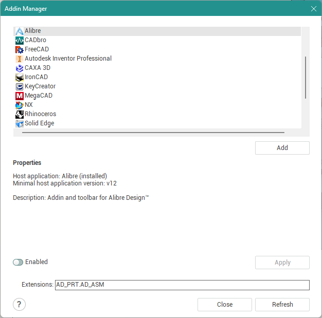

# Add-in Wizard

A CAM system UI tool for managing the lifecycle of Add-ins. Implemented by the `AddinManager.dll` library that is part of the CAM system.

When you select an Add-in in the top list, all of its additional information is shown in the `Properties` panel. Usually this is the name and version of the application the Add-in works with, a description of the capabilities it provides, and other information.

The `Extensions` field appears on screen when the Add-in selected in the list operates on files with certain extensions (for example, import/export).

The `Enable` checkbox changes the installation setting of the selected Add-in.

The `Apply` button applies the value of the `Enable` checkbox to the selected Add-in.

The `Close` button closes the Add-in Wizard. If any changes were made, closing prompts the question: "Exit and save / Exit without saving / Cancel exit".

The `Refresh` button refreshes the list of Add-ins and all data about them. Any unsaved changes are lost in the process.
