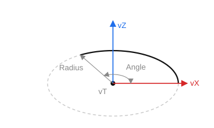

# Circular arc

`CreateArc(ID: string; Radius, Angle: STFloat; vT, vZ, vX: TST3DPoint)` — create a circular arc. The circle is defined by a point and a radius. Construction starts from `vX` counterclockwise and sweeps through the angle `Angle`.

- `ID` — entity identifier;
- `Radius` — radius;
- `Angle` — arc sweep angle (measured from `vX`);
- `vT` — center point; 
- `vZ` — Z axis; 
- `vX` — X axis.

