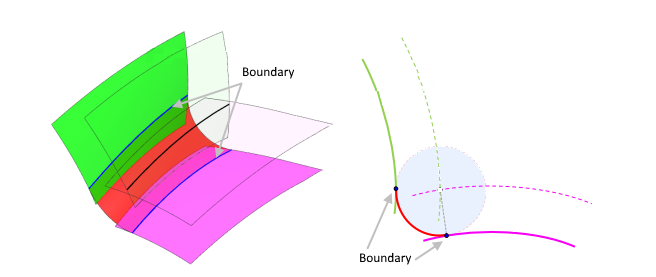

# Blend boundary

In the Parasolid XT format this is an auxiliary (construction) surface `blend_bound`, defined implicitly so that it intersects the corresponding supporting blend surface along the sought boundary line and is orthogonal both to the blend and to that surface along it. It has no parametrization of its own and in practice is represented by an intersection curve, so in our model it is created as a curve. The supporting surface to which the boundary corresponds is selected by the `Boundary` index — it is `surface[1 − Boundary]` from the pair of supporting surfaces of the `Blend`.

`CreateBlendBound(ID, Blend: string; Boundary: integer)` — blend boundary: the curve along which the blend surface (see [Blend surface](blended-surface.md)) is tangent to one of its supporting surfaces.

- `ID` — identifier of the entity being created;
- `Blend` — identifier of the blend surface (`ID` from `CreateBlendedSurface`, see [Blend surface](blended-surface.md));
- `Boundary` — index of the supporting surface of the blend (`0` or `1`).

