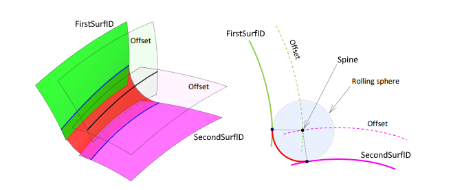

# Blend surface

An exact rolling-ball blend surface between two surfaces. Corresponds to the `blended_edge` surface of the Parasolid XT format and usually arises when blending an edge between two faces.

The spine is built as the intersection curve of two **offset surfaces** — the supporting surfaces displaced by the amounts `Range1` and `Range2`. The offset is measured along the unit surface normal multiplied by `Range` (and by −1 if the surface orientation is negative); `Range` values may also be negative. For a constant-radius blend, both values equal the ball radius.

> Where possible, blends are modeled by simpler surfaces — cylindrical, toroidal, or spherical — and complex ones (variable radius, non-circular cross-section) by NURBS surfaces. A dedicated blend surface (`blended_edge`) is used only when a simpler representation is not possible.

`CreateBlendedSurface(ID, FirstSurfID, SecondSurfID, Spine: string; Range1, Range2: STFloat; BlendedType: TSTBlendedType; p1: TST3DPoint; L1: TSTLimitType; p2: TST3DPoint; L2: TSTLimitType)` — create a blend surface.

- `ID` — identifier of the entity being created;
- `FirstSurfID`, `SecondSurfID` — the two supporting surfaces (adjacent to the original edge) between which the blend is built;
- `Spine` — spine: the axial curve of the blend, the path of the center of the rolling ball; built as the intersection curve of two offset surfaces;
- `Range1`, `Range2` — the offsets applied to the first and second surfaces respectively; in the figure they define the "**Offset**" offset surfaces (dashed), whose intersection gives the spine; for a constant radius they equal the ball radius;
- `BlendedType` — blend type (`TSTBlendedType`): `R` — rolling ball; the ball in the figure is labeled "**Rolling sphere**", its radius equals `Range`, and its center rolls along the spine; `E` — "cliff edge", when one of the surfaces is itself a blend with range `[0, 0]`, and the spine coincides with the cliff edge;
- `p1`, `L1` — start point and its boundary type (`TSTLimitType`, see [Intersection curve](intersection-curve.md));
- `p2`, `L2` — end point and its boundary type.

The fields `p1`/`L1` and `p2`/`L2` are specified (boundary type `L`) only in degenerate cases — when the spine is periodic but the blended edge has ends (for example, the spine is elliptical and the blend degenerates). In the ordinary case the boundaries are unbounded (type `U`).



`TSTBlendedType` and `TSTLimitType` are **SGF** types, not CAD system types. Therefore the parameter class uses the add-in's own enumerations, and before calling `CreateBlendedSurface` they are **cast** to SGF types (just as points are cast to `TST3DPoint`).

**Example of saving a blend surface.**

```csharp
// the add-in's own enumerations (CAD side, without SGF types)
enum CADBlendKind  { RollingBall, Cliff }              // corresponds to R / E
enum CADBorderKind { NotSet, Terminator, ArbLimit }    // corresponds to U / T / L

// Parameters of a CAD system blend surface
class CADBlendParam
{
    public CADSurface    Surface1, Surface2;  // the two supporting surfaces
    public CADCurve      Spine;               // spine (axial curve of the blend)
    public double        Range1, Range2;      // offsets of the offset surfaces (for a constant radius = ball radius)
    public CADBlendKind  Kind;                // blend type (CAD side)
    public CADPoint      P1, P2;              // boundary points (usually not used)
    public CADBorderKind L1, L2;              // boundary types (NotSet in the ordinary case)
}

bool SaveBlendedSurface(string id, CADBlendParam param)
{
    // first save the supporting objects: both surfaces and the spine
    if (!SaveSurface(param.Surface1) || !SaveSurface(param.Surface2) || !SaveCurve(param.Spine))
        return false;

    // cast the CAD enumerations to SGF types via switch
    TSTBlendedType blendedType;
    switch (param.Kind)
    {
        case CADBlendKind.Cliff: blendedType = TSTBlendedType.E; break;   // "cliff edge"
        default:                 blendedType = TSTBlendedType.R; break;   // rolling ball
    }

    // blend surface (points are cast to TST3DPoint)
    return sgr.CreateBlendedSurface(id, param.Surface1.Id, param.Surface2.Id, param.Spine.Id,
                                    param.Range1, param.Range2, blendedType,
                                    ToPoint(param.P1), ToLimit(param.L1),
                                    ToPoint(param.P2), ToLimit(param.L2));
}

// boundary-type cast function (used for L1 and L2)
TSTLimitType ToLimit(CADBorderKind k)
{
    switch (k)
    {
        case CADBorderKind.Terminator: return TSTLimitType.T;
        case CADBorderKind.ArbLimit:   return TSTLimitType.L;
        default:                       return TSTLimitType.U;   // not set
    }
}
```
