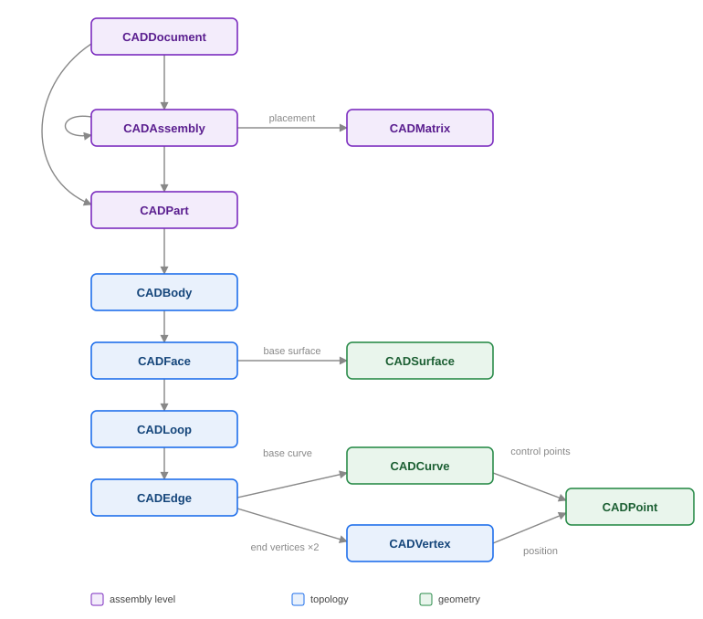

# CAD model structure

> **This is a notional (fictitious) structure.** The `CADxxx` classes described below are *not* part of the CAM-system API and do not relate to any particular CAD system. This is a simplified data model of a "hypothetical" CAD, introduced solely so that the code examples show *where* the source data comes from and *how* it maps to SGF calls. In a real Add-in, the types of your CAD system (or its API) will take their place, while the conversion logic stays the same.

A CAD model is a hierarchy of related objects: from the document as a whole down to individual points. Importing into SGF is essentially a traversal of this hierarchy, translating each object into the corresponding `ISTGeomReceiver` call.

Model entities (top-down — from the assembly level to geometric primitives):

| Entity | What it is | Imported via |
|----------|---------|---------------------|
| **CADDocument** | The model root — the entire CAD document. The `IsDetail` flag determines the content: a part (`CADPart`) or an assembly (`CADAssembly`). | [model tree](assembly.md) |
| **CADAssembly** | Assembly: a component tree. For each component, the `IsDetail` flag selects a part (`CADPart`) or a nested assembly (`CADAssembly`); the position is defined by a matrix (`CADMatrix`). | [Blocks / instances](assembly.md) |
| **CADMatrix** | Placement matrix: the position and orientation of an assembly component in the parent's coordinate system. | [placement matrix](assembly.md) |
| **CADPart** | Part: one or more bodies plus attributes (name, color). | [parts and bodies](part.md) |
| **CADBody** | Body: a shell of faces describing the topology (faces, edges, vertices). | [ComboSolid](part.md) |
| **CADFace** | Face: a region of the underlying surface bounded by loops. | [trimmed surface](face.md) |
| **CADSurface** | The underlying surface of a face: plane, cylinder, cone, sphere, torus, NURBS, mesh, etc. | [surfaces](surfaces.md) |
| **CADLoop** | Face loop — a closed sequence of edges. The outer loop defines the boundary, the inner ones define holes. | [face loops](face.md) |
| **CADEdge** | Edge: a segment of the underlying curve (`CADCurve`) between two vertices (`CADVertex`). | [trimmed curve](curves-and-points.md) / [edge](face.md) |
| **CADVertex** | Vertex — the end point of an edge; its position is defined by a point (`CADPoint`). | [body (ComboSolid)](part.md) |
| **CADCurve** | The underlying curve of an edge: line segment, arc, ellipse, NURBS, intersection curve, etc. | [curves](curves-and-points.md) |
| **CADPoint** | A point in 3D (X/Y/Z coordinates) — the base primitive: the position of vertices (`CADVertex`), and the control and support points of curves and surfaces. | as a parameter of other calls |

Relationships between entities:

- **CADDocument → CADPart | CADAssembly** — by the `IsDetail` flag: a document is either a single part or an assembly;
- **CADAssembly → CADPart | CADAssembly** — by the `IsDetail` flag, an assembly component is a part or a nested assembly (hence the tree recursion);
- **CADAssembly → CADMatrix** — an assembly stores the placement matrix of a component;
- **CADPart → CADBody** — a part consists of bodies;
- **CADBody → CADFace** — a body is bounded by a set of faces;
- **CADFace → CADSurface (1) + CADLoop (1..\*)** — a face has one underlying surface and one or more loops;
- **CADLoop → CADEdge** — a loop consists of edges;
- **CADEdge → CADCurve (1) + CADVertex (2)** — an edge relies on one underlying curve and is bounded by two vertices;
- **CADVertex → CADPoint** — a vertex is defined by a position point;
- **CADCurve / CADSurface → CADPoint** — points serve as control points (for NURBS) and support points.

In the following chapters, the examples are laid out as `SaveXxx` methods that receive such a `CADxxx` object and translate it into SGF.
