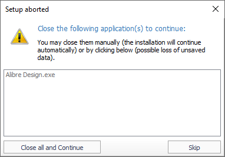

# CheckLockToolbar utility

**CheckLockToolbar** is a repository of helper code that simplifies development of the Translator. The `LockProcManager` unit (implementations in both Delphi and C# are available) is added to the project; its functions are described below. The repository also builds the `CheckLockToolbar.exe` utility, which can be invoked as a separate process if adding the unit is undesirable.

---

**`IsTerminateProc(ProcessNames: string): boolean`**

Checks whether the specified processes are running in the system. If any are found, it shows a dialog:

This dialog lets you forcibly terminate the specified processes or ignore them.

The function can be used during installation/uninstallation of the Add-in, since access to the required files can sometimes be locked by the CAD system.

Parameters:

| Parameter | Description |
|----------|----------|
| `ProcessNames` | Process names separated by spaces, for example `"Alibre Design.exe"`. |

Result:

| Value | Description |
|----------|----------|
| `True` | The specified processes are not active or were closed. |
| `False` | The specified processes could not be closed, or the user cancelled closing them. |

---

**`RunAs(Filename, Parameters: string; Admin: boolean; WinState: DWORD; Wait: boolean = true): boolean`**

Runs an executable file with parameters.

Parameters:

| Parameter | Description |
|----------|----------|
| `Filename` | Name of the executable file. |
| `Parameters` | List of parameters, separated by spaces. |
| `Admin` | Flag: run with administrator privileges. |
| `WinState` | Process startup parameters (for example, `SW_HIDE`, `SW_SHOW`). |
| `Wait` | Flag: wait for the process to finish. |

Result:

| Value | Description |
|----------|----------|
| `True` | The file was started successfully. |
| `False` | An error occurred while starting. |

---

**`RunRegsvr32(DllPath, Param: string): boolean`**

Registers/unregisters a library using the `regsvr32` utility, essentially acting as a wrapper for it.

Parameters:

| Parameter | Description |
|----------|----------|
| `DllPath` | Path to the library. |
| `Param` | Parameters for the `regsvr32` utility: `dllregisterserver` for registration, `dllunregisterserver` for unregistration. |

Result:

| Value | Description |
|----------|----------|
| `True` | The library was successfully registered/unregistered. |
| `False` | Error. |
