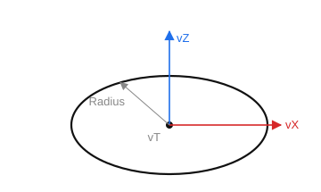

# Circle

`CreateCircle(ID: string; Radius: STFloat; vT, vZ, vX: TST3DPoint)` — create a circle from a point and a radius. Construction starts from `vX` and proceeds counterclockwise.

- `ID` — entity identifier;
- `Radius` — radius;
- `vT` — center point;
- `vZ` — Z axis;
- `vX` — X axis.

