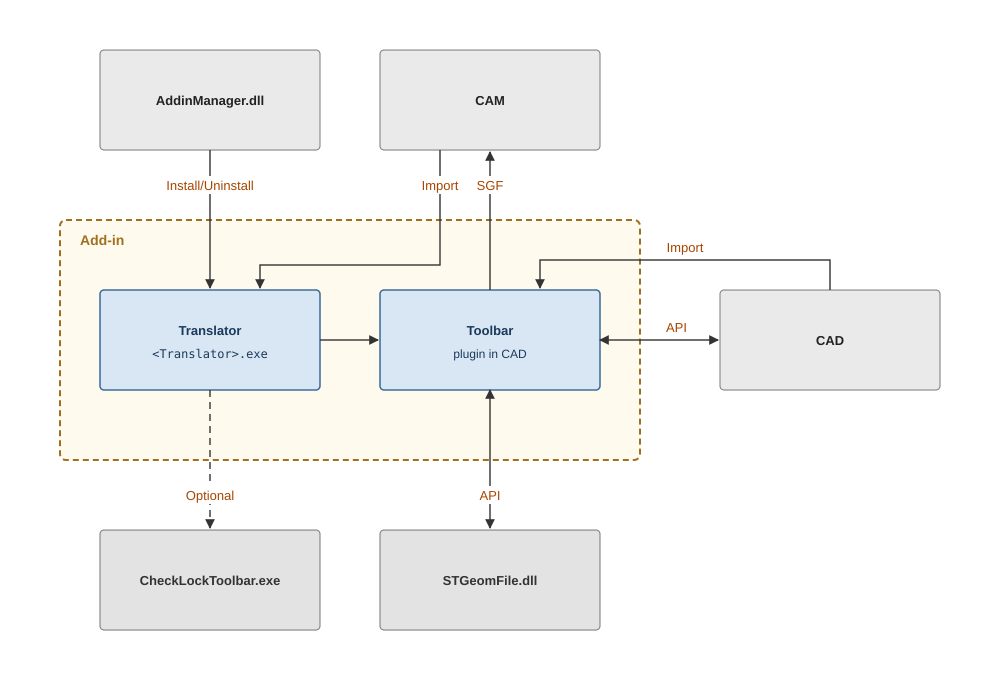

# Component description

An Add-in consists of two parts: the Translator (`<Translator>.exe`) and the Toolbar (a plugin in the CAD). They interact with three external participants — the Add-ins Wizard, the CAD system, and the CAM system.

The Add-in components and its environment, as well as the distribution files, are described below:

- **[Add-ins Wizard](addins-wizard.md)** — a CAM system UI tool (`AddinManager.dll`) for managing the Add-in lifecycle.
- **[Distribution files](distribution-files.md)** — where Add-ins are stored, the path template, and the mandatory folder contents.
- **[Translator](translator.md)** — the single entry point `<Translator>.exe`: the command-line contract and the return codes.
- **[Add-in XML file](xml-descriptor.md)** — Add-in metadata, supported formats, and command names.
- **[CAMInfo.ini file](caminfo-ini.md)** — the current CAM system settings available to Add-ins.
- **[CheckLockToolbar utility](checklocktoolbar.md)** — helper code (`LockProcManager`) that simplifies developing the Translator.
- **[Toolbar](toolbar-plugin.md)** — a button in the CAD system that transfers geometry to the CAM system.
