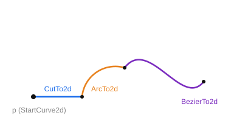
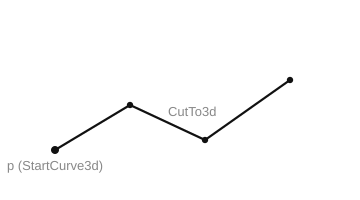

# Composite curve

A composite curve is assembled through a sequence of calls: it is opened from a start point, extended with segments, and finished with a closing call. It can be planar (in a local plane) or spatial.

**Planar (2D).** Built in a local plane and extended with line segments, arcs, and Bezier curves.

**`StartCurve2d(ID: string; p: TST2DPoint; vT, vZ, vX: TST3DPoint)`** — start a 2D curve from point `p`.

- `ID` — entity identifier;
- `p` — start point (in plane coordinates);
- `vT` — position of the plane; 
- `vZ` — normal; 
- `vX` — X axis.

**`CutTo2d(p: TST2DPoint)`** — extend with a line segment to point `p`.

- `p` — end point of the segment.

**`ArcTo2d(pc, p: TST2DPoint; rad: STFloat)`** — extend with an arc to point `p`.

- `pc` — center of the arc;
- `p` — end point;
- `rad` — radius of the arc.

**`BezierTo2d(p1, p2, p3: TST2DPoint)`** — extend with a 3rd-order Bezier curve.

- `p1`, `p2`, `p3` — control points of the Bezier curve.

**`CloseCurve2d(Close: boolean)`** — finish the curve.

- `Close` — when `true`, the curve is closed.

**Spatial (3D).** Built in space and extended with line segments.

**`StartCurve3d(ID: string; p: TST3DPoint)`** — start a 3D curve from point `p`.

- `ID` — entity identifier;
- `p` — start point.

**`CutTo3d(p: TST3DPoint)`** — extend with a line segment to point `p`.

- `p` — end point of the segment.

**`CloseCurve3d(IsClosed: boolean)`** — finish the curve.

- `IsClosed` — when `true`, the curve is closed.

