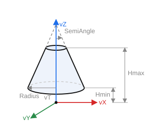

# Cone

`CreateConeP(ID: string; Location, Axis, RefAxis: TST3DPoint; Radius, SemiAngle, Hmin, Hmax, Amin, Amax: STFloat)` — create a conical surface.

- `ID` — entity identifier;
- `Location` — position (`vT`);
- `Axis` — Z axis (`vZ`);
- `RefAxis` — X axis (`vX`);
- `Radius` — radius (in the `Location` plane);
- `SemiAngle` — half-angle at the cone apex;
- `Hmin`, `Hmax` — height bounds (along the axis);
- `Amin`, `Amax` — angular sector bounds (full cone — from `0` to `2π`).

