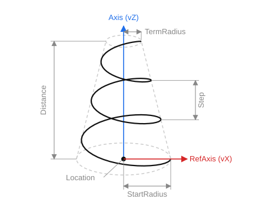

# Conical spiral

`CreateConicalSpiral(ID: string; Location, Axis, RefAxis: TST3DPoint; StartRadius, TermRadius, Step, Distance: STFloat; CCW: boolean)` — create a conical spiral around the `Axis` axis.

- `ID` — the entity identifier;
- `Location` — the center of the base (position, analogous to `vT`);
- `Axis` — the spiral axis (analogous to `vZ`);
- `RefAxis` — the reference direction (analogous to `vX`);
- `StartRadius` — the radius at the start;
- `TermRadius` — the radius at the end;
- `Step` — the step (rise per turn);
- `Distance` — the length along the axis;
- `CCW` — the direction of rotation (True = counterclockwise).

