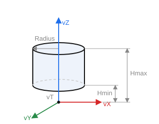

# Cylinder

`CreateCylinderP(ID: string; Location, Axis, RefAxis: TST3DPoint; Radius, Hmin, Hmax, Amin, Amax: STFloat)` — create a cylindrical surface. The axis runs along the `Axis` vector.

- `ID` — entity identifier;
- `Location` — position (`vT`);
- `Axis` — Z axis (`vZ`);
- `RefAxis` — X axis (`vX`);
- `Radius` — radius;
- `Hmin`, `Hmax` — height bounds (along the axis);
- `Amin`, `Amax` — angular sector bounds (a full cylinder runs from `0` to `2π`).

