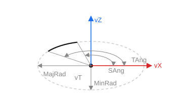

# Elliptical arc

`CreateEllipseArc(ID: string; MajRad, MinRad, SAng, TAng: STFloat; vT, vZ, vX: TST3DPoint)` — create an elliptical arc from two angles. All angles are measured from `vX` counterclockwise.

- `ID` — entity identifier;
- `MajRad` — major semi-axis (along the X axis);
- `MinRad` — minor semi-axis (along the Y axis);
- `SAng` — start angle of the arc;
- `TAng` — end angle of the arc;
- `vT` — center point;
- `vZ` — Z axis;
- `vX` — X axis.

