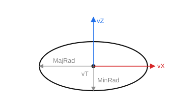

# Ellipse

`CreateEllipse(ID: string; MajRad, MinRad: STFloat; vT, vZ, vX: TST3DPoint)` — create an ellipse.

- `ID` — entity identifier;
- `MajRad` — major semi-axis (along the X axis);
- `MinRad` — minor semi-axis (along the Y axis);
- `vT` — center point; 
- `vZ` — Z axis; 
- `vX` — X axis.

