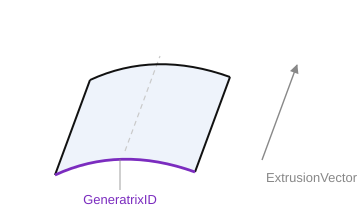

# Extrusion surface

`CreateTabSurface122(ID: string; GeneratrixID: string; ExtrusionVector: TST3DPoint)` — a ruled extrusion surface: the generatrix curve is swept along a vector.

- `ID` — identifier of the entity to create;
- `GeneratrixID` — identifier of the generatrix curve;
- `ExtrusionVector` — extrusion vector (direction and length).



**Example of saving an extrusion surface.**

```csharp
// Extrusion surface parameters from the CAD system
class CADExtrusionParam
{
    public CADCurve Curve;            // generatrix curve
    public CADPoint ExtrusionVector;  // extrusion vector (direction and length)
}

bool SaveExtrusion(string id, CADExtrusionParam param)
{
    if (!SaveCurve(param.Curve))
        return false;

    return sgr.CreateTabSurface122(id, param.Curve.Id, ToPoint(param.ExtrusionVector));
}
```
