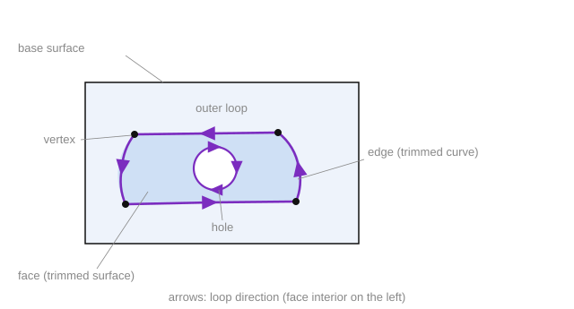

# Face (trimmed surface)

A bounded region can be cut out of a surface — a **face** (trimmed surface) — and added to the geometry tree as a standalone object, or as part of a shell. A face consists of a *base surface* and one or more *contours (loops)* that bound the region being cut out. In this way a face **links two kinds of geometry**: the underlying surface (built with the methods in the [Surfaces](surfaces.md) chapter) and the contour edge curves together with their vertices (the [Curves and points](curves-and-points.md) chapter).

**How it works.**

1. **Base surface.** A face is built on top of a previously saved surface (any of the [Surfaces](surfaces.md)). It is opened by calling `StartFace(ID, SurfaceID, NormalOrientation)`, where `SurfaceID` is the identifier of that surface, and `NormalOrientation` specifies whether the face normal coincides with the surface normal.
2. **Contour (loop).** This is a closed sequence of edges running along the boundary of the region being cut out; it is opened with `StartFaceLoop` and closed with `CloseFaceLoop`. There can be several contours: the first is typically the outer boundary, and the rest are holes inside the face.
3. **Loop traversal direction.** The region being kept (the face body) must lie **to the left** of the traversal direction (when looking against the face normal). Therefore the outer contour is traversed *counterclockwise*, and hole contours *clockwise*. The direction is set both by the order in which edges are added and by the `Orientation` flag of each edge (whether the traversal direction matches the direction of the supporting curve).
4. **Edge = trimmed curve between two vertices.** The ends of an edge — the *vertices* — are created as 3D points by calling `CreatePoint(ID, P)` (`AddFaceEdge3d` references them by identifier). The geometry of the edge itself is a **trimmed curve**: a supporting 3D curve (a line segment, arc, NURBS, intersection curve, etc., already saved in the SGF) is taken and trimmed between the endpoints of the edge by calling `CreateTrimmedCurve2(ID, SourceCurveID, p1, p2)` (for a straight edge you can use `CreateLineSeg` directly). If the edge is directed against the supporting curve, the curve is either reversed beforehand with `CreateInversedCurve` or `Orientation = false` is passed. The completed edge is added to the current loop: `AddFaceEdge3d` for a spatial curve, `AddFaceEdge2d` for a curve specified in the surface's UV parameters (see `CreateCurveOnSurface`).
5. **Completion and adding to the tree.** The face is closed with `CloseFace` (which returns a flag indicating whether "closure" succeeded). For the trimmed surface to appear in the geometry tree as a standalone object, it is registered by calling `AddEntity(ID, EntityName)` — where `ID` matches the face identifier from `StartFace`.



**`StartFace(ID, SurfaceID: string; NormalOrientation: boolean)`** — begin a face based on a previously saved surface.

- `ID` — identifier of the face to create;
- `SurfaceID` — identifier of the supporting (base) surface;
- `NormalOrientation` — whether the face normal coincides with the base surface normal (`true` — coincides, `false` — opposite).

**`StartFaceLoop()`** — begin a face contour (loop).

**`AddFaceEdge2d(CurveID: string; Orientation: boolean; svID, tvID: string)`** — add an edge to the current contour using a curve specified in the surface's UV parameters (see [Curve on surface](curve-on-surface.md)).

- `CurveID` — identifier of the edge's supporting curve;
- `Orientation` — whether the contour traversal direction matches the curve direction (`false` — the curve is traversed in the opposite direction);
- `svID` — identifier of the edge's start vertex;
- `tvID` — identifier of the edge's end vertex.

**`AddFaceEdge3d(CurveID: string; Orientation: boolean; svID, tvID: string)`** — same as `AddFaceEdge2d`, but the edge is specified by a spatial (3D) curve; `svID` and `tvID` reference vertices — 3D points created by calling `CreatePoint`.

- `CurveID` — identifier of the edge's supporting 3D curve;
- `Orientation` — whether the contour traversal direction matches the curve direction;
- `svID` — identifier of the edge's start vertex;
- `tvID` — identifier of the edge's end vertex.

**`CloseFaceLoop()`** — finish the current contour.

**`CloseFace()`** — finish the face (returns a flag indicating whether closure succeeded).

**Face color.** The face color is set the same way as for other objects — by calling `SetCurrentColor` before `StartFace`; for how the current color behaves (state, inheritance, value format) see [Curves and points](curves-and-points.md).

**Example: importing a CAD-model face into SGF.** The `SaveTrimmedFace` method receives a `CADFace`, saves its underlying surface, then opens the face on top of it and traverses its contours.

```csharp
bool SaveTrimmedFace(CADFace face)
{
    if (!SaveSurface(face.Surface))
        return false;

    // the face color is set before StartFace — by analogy with curves (see "Curves and points")
    sgr.SetCurrentColor(face.Color);

    sgr.StartFace(face.Id, face.Surface.Id, face.SameSense);
    try
    {
        for (int i = 0; i < face.Loops.Length; i++)
        {
            CADLoop loop = face.Loops[i];
            sgr.StartFaceLoop();
            try
            {
                // the edge order sets the traversal direction:
                // outer contour — counterclockwise, holes — clockwise
                for (int j = 0; j < loop.Edges.Length; j++)
                {
                    // composite edge identifier: face.loop.edge
                    string edgeId = $"{face.Id}.{i}.{j}";
                    SaveFaceEdge(edgeId, loop.Edges[j]);
                }
            }
            finally
            {
                sgr.CloseFaceLoop();
            }
        }
    }
    finally
    {
        sgr.CloseFace();
    }
    return true;
}

// Saving a single contour edge
bool SaveFaceEdge(string edgeId, CADEdge edge)
{
    if (!SaveCurve(edge.Curve))
        return false;

    // edge geometry — the supporting curve, trimmed between the vertices (coordinates converted to TST3DPoint)
    sgr.CreateTrimmedCurve2(edgeId, edge.Curve.Id,
                            ToPoint(edge.Start.Point), ToPoint(edge.End.Point));

    // add the edge to the loop (3D); SameSense — whether the traversal matches the curve direction
    return sgr.AddFaceEdge3d(edgeId, edge.SameSense, edge.Start.Id, edge.End.Id);
}
```

The helper methods `SaveSurface(CADSurface)` and `SaveCurve(CADCurve)` select the call based on the geometry type (plane, cylinder, NURBS, line segment, arc, etc. — see [Surfaces](surfaces.md)–[Curves and points](curves-and-points.md)), write it to the SGF, and return a success flag; the identifier is taken from the object itself (the `Id` field).
