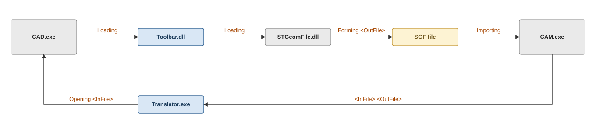

# Import a CAD file into a CAM system

1. In the CAM system, the user imports a CAD file.
2. By the file extension, the CAM system finds the appropriate Add-in, and if there are several, it shows the user a dialog to choose one.
3. The CAM system calls `<Translator>.exe <InFile> <OutFile>` (see [Translator](translator.md)).
4. The translator launches an instance of the CAD system (in hidden mode where possible, so as not to disturb the user's session).
5. The translator creates a new CAD-system document, loads `InFile` into it, and launches the Toolbar for import, passing it `OutFile` as the output file.
6. The Toolbar converts the geometry into one of the CAM system's internal formats (into SGF for direct import, or into any other supported format) and saves the result to `OutFile`.
7. The translator closes the document and the open instance of the CAD system.
8. The CAM system loads the geometry from `OutFile` and deletes it.
