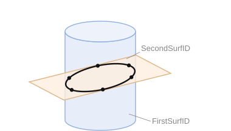

# Intersection curve

An intersection curve is a spatial curve that lies simultaneously on two surfaces, along the line where they intersect. Both surfaces must be created beforehand and are passed by their identifiers.

**`StartIntersectionCurve(ID: string; FirstSurfID, SecondSurfID: string; L1, L2: TSTLimitType; BaseParam, BaseScale: STFloat)`** — begin building the intersection curve of two surfaces.

- `ID` — identifier of the entity being created;
- `FirstSurfID` — identifier of the first surface;
- `SecondSurfID` — identifier of the second surface;
- `L1` — type of the start boundary (see `TSTLimitType`);
- `L2` — type of the end boundary (see `TSTLimitType`);
- `BaseParam` — parameter of the first point lying on the intersection curve;
- `BaseScale` — parameterization scale.

**`AddIntersectionCurvePoint(Position: TST3DPoint)`** — add an intersection point.

- `Position` — coordinates of the point.

**`CloseIntersectionCurve()`** — finish building the intersection curve.

The `TSTLimitType` enumeration specifies the **boundary type** at the ends of the intersection curve (`L1` — start, `L2` — end) — that is, exactly how the curve is bounded on each side:

| Value | Boundary type | Description |
|----------|-------------|----------|
| `H` | help vector | The end is defined by an auxiliary ("help") direction vector. |
| `T` | terminator | The curve terminates at an explicitly specified terminator point; for such a boundary, a boundary point is added to the curve with the `AddIntersectionCurvePoint` method. |
| `L` | arbitrary boundary | An arbitrary limit on the end of the curve. |
| `B` | spine boundary | The end is bounded by the edge of the spine region. |
| `U` | not defined | The boundary is not defined (no limit). |

The same boundary types are also used when creating a blended surface (`CreateBlendedSurface`, see [Blended surface](blended-surface.md)).



**Example of importing an intersection curve.** It is assumed that both surfaces are already saved, and the curve points and boundary parameters have been obtained from CAD. The curve is written as a sequence of points; for boundaries of type `T` (terminators), explicit boundary points are additionally added.

```csharp
// CAD system intersection curve: two supporting surfaces + points
class CADIntersectionCurve
{
    public string       Id;         // curve identifier in CAD
    public string       Surf1Id;    // identifier of the first surface (already saved)
    public string       Surf2Id;    // identifier of the second surface (already saved)
    public TSTLimitType StartLim;   // type of the start boundary
    public TSTLimitType EndLim;     // type of the end boundary
    public double       BaseParam;  // parameter of the first point on the curve
    public double       BaseScale;  // parameterization scale
    public CADPoint[]   Points;     // points of the intersection curve
    public CADPoint     StartPoint; // boundary point (for a boundary of type T)
    public CADPoint     EndPoint;   // boundary point (for a boundary of type T)
}

bool SaveIntersectionCurve(CADIntersectionCurve curve)
{
    sgr.StartIntersectionCurve(curve.Id, curve.Surf1Id, curve.Surf2Id,
                               curve.StartLim, curve.EndLim, curve.BaseParam, curve.BaseScale);
    try
    {
        // convert CAD point coordinates to TST3DPoint
        if (curve.StartLim == TSTLimitType.T)
            sgr.AddIntersectionCurvePoint(ToPoint(curve.StartPoint));

        foreach (CADPoint v in curve.Points)
            sgr.AddIntersectionCurvePoint(ToPoint(v));

        if (curve.EndLim == TSTLimitType.T)
            sgr.AddIntersectionCurvePoint(ToPoint(curve.EndPoint));
    }
    finally
    {
        sgr.CloseIntersectionCurve();
    }
    return true;
}
```
