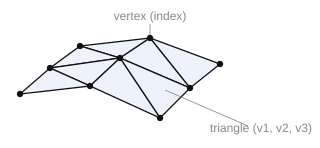

# Polygonal mesh

A polygonal mesh is formed by a set of triangles, each consisting of three vertices.

**`StartMesh(ID: string)`** — begin building the mesh.

- `ID` — entity identifier.

**`AddMeshVertex(index: integer; p: TST3DPoint)`** — add a vertex.

- `index` — vertex index (used in `AddMeshTriangle`);
- `p` — vertex coordinates.

**`AddMeshTriangle(v1, v2, v3: integer)`** — add a triangle.

- `v1`, `v2`, `v3` — the indices of the three vertices.

**`CloseMesh()`** — finish building the mesh.



**Example of importing a polygonal mesh.** Each vertex is added once — by its index (repeated indices from different triangles are skipped), then triangles are added by these indices.

```csharp
// Parameters of the CAD system's polygonal mesh
class CADMeshParam
{
    public CADPoint[] Vertices;  // vertices (index = position in the array)
    public int[][]    Triangles; // triangles: triples of vertex indices
}

bool SaveMesh(string id, CADMeshParam meshParam)
{
    sgr.StartMesh(id);
    try
    {
        var added = new HashSet<int>();
        foreach (int[] tri in meshParam.Triangles)
        {
            // add each vertex once — by its index (convert to TST3DPoint)
            foreach (int vIndex in tri)
                if (added.Add(vIndex))   // convert the vertex to TST3DPoint
                    sgr.AddMeshVertex(vIndex, ToPoint(meshParam.Vertices[vIndex]));

            sgr.AddMeshTriangle(tri[0], tri[1], tri[2]);
        }
    }
    finally
    {
        sgr.CloseMesh();
    }
    return true;
}
```
