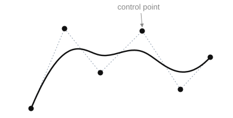

# NURBS curve

A NURBS curve is formed through a sequence of calls: open (`StartNurbsCurve`), set the control points, weights, and knots, then close (`CloseNurbsCurve`).

**`StartNurbsCurve(ID: string; Degree: integer; IsPeriodic, IsRational, IsClosed: boolean; KnotCount, CPCount: integer)`** — begin forming a NURBS curve.

- `ID` — entity identifier;
- `Degree` — degree of the curve;
- `IsPeriodic` — periodicity flag;
- `IsRational` — rationality flag;
- `IsClosed` — closedness flag;
- `KnotCount` — number of knots;
- `CPCount` — number of control points.

**`SetNurbsCurveControlPoint(Index: integer; P: TST3DPoint)`** — set a control point by index.

- `Index` — index of the control point;
- `P` — coordinates of the point.

**`SetNurbsCurveWeight(Index: integer; w: STFloat)`** — set the weight of a control point.

- `Index` — index of the control point;
- `w` — weight.

**`SetNurbsCurveKnot(Index: integer; knot: STFloat)`** — set a knot.

- `Index` — index of the knot;
- `knot` — knot value.

**`CloseNurbsCurve()`** — finish forming the NURBS curve.



**Example of importing a NURBS curve.** 

```csharp
// Parameters of a CAD system NURBS curve
class CADNurbsParam
{
    public int         Degree;        // degree of the curve
    public bool        Periodic;      // periodicity
    public bool        Rational;      // rationality
    public bool        Closed;        // closedness
    public double[]    Knots;         // full knot vector
    public CADPoint[]  ControlPoints; // control points (CAD vertices)
    public double[]    Weights;       // weights (one per control point)
}

bool SaveNurbsCurve(string id, CADNurbsParam param)
{
    sgr.StartNurbsCurve(id, param.Degree, param.Periodic, param.Rational, param.Closed,
                        param.Knots.Length, param.ControlPoints.Length);
    try
    {
        // knot vector
        for (int i = 0; i < param.Knots.Length; i++)
            sgr.SetNurbsCurveKnot(i, param.Knots[i]);

        // control points: weight + coordinates (cast to TST3DPoint)
        for (int i = 0; i < param.ControlPoints.Length; i++)
        {
            double w = param.Weights[i];
            TST3DPoint p = ToPoint(param.ControlPoints[i]);

            // for a rational curve, control points are given in homogeneous form (× weight)
            if (param.Rational)
            {
                p.X *= w;
                p.Y *= w;
                p.Z *= w;
            }

            sgr.SetNurbsCurveWeight(i, w);
            sgr.SetNurbsCurveControlPoint(i, p);
        }
    }
    finally
    {
        sgr.CloseNurbsCurve();
    }
    return true;
}
```
