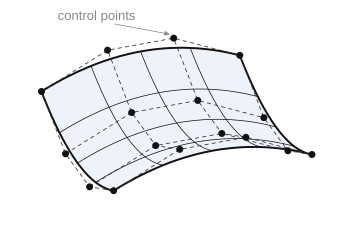

# NURBS surface

A NURBS surface is formed by a sequence of calls: open (`StartNurbsSurface`), set the knots along U and V, the control points and weights in an `i×j` grid, close (`CloseNurbsSurface` or `CloseNurbsSurfaceB`).

**`StartNurbsSurface(ID: string; K1, K2, UDegree, VDegree: integer; UClosed, VClosed, UPeriodic, VPeriodic, Rational: boolean)`** — begin forming a NURBS surface.

- `ID` — entity identifier;
- `K1` — index of the number of control points along U: `K1 = UKnotCount − UDegree − 2`;
- `K2` — index of the number of control points along V: `K2 = VKnotCount − VDegree − 2`;
- `UDegree`, `VDegree` — degrees along U and V;
- `UClosed`, `VClosed` — closedness flags along U and V;
- `UPeriodic`, `VPeriodic` — periodicity flags along U and V;
- `Rational` — rationality flag.

**`SetNurbsSurfaceUKnot(i: integer; Value: STFloat)`** — set a U knot.

- `i` — knot number;
- `Value` — knot value.

**`SetNurbsSurfaceVKnot(i: integer; Value: STFloat)`** — set a V knot.

- `i` — knot number;
- `Value` — knot value.

**`SetNurbsSurfaceControlPoint(i, j: integer; P: TST3DPoint)`** — set a control point in the grid.

- `i`, `j` — position of the control point in the grid;
- `P` — point coordinates.

**`SetNurbsSurfaceWeight(i, j: integer; Value: STFloat)`** — set the weight of a control point.

- `i`, `j` — position of the control point in the grid;
- `Value` — weight.

**`CloseNurbsSurface()`** — finish forming the surface.

**`CloseNurbsSurfaceB(UMin, UMax, VMin, VMax: STFloat)`** — finish forming with explicit parameter ranges.

- `UMin`, `UMax` — bounds of the U parameter;
- `VMin`, `VMax` — bounds of the V parameter.



**Example of importing a NURBS surface.**

```csharp
// NURBS surface parameters from the CAD system
class CADNurbsSurfParam
{
    public int         UDegree, VDegree;      // degrees along U and V
    public bool        UClosed, VClosed;      // closedness along U and V
    public bool        UPeriodic, VPeriodic;  // periodicity along U and V
    public bool        Rational;              // rationality
    public double[]    UKnots, VKnots;        // full knot vectors along U and V
    public CADPoint[,] ControlPoints;         // control point grid
    public double[,]   Weights;               // weights (one per control point)
}

bool SaveNurbsSurface(string id, CADNurbsSurfParam param)
{
    // control point count indices: K = KnotCount - Degree - 2
    int k1 = param.UKnots.Length - param.UDegree - 2;
    int k2 = param.VKnots.Length - param.VDegree - 2;

    sgr.StartNurbsSurface(id, k1, k2, param.UDegree, param.VDegree,
                          param.UClosed, param.VClosed, param.UPeriodic, param.VPeriodic, param.Rational);
    try
    {
        // knot vectors along U and V
        for (int i = 0; i < param.UKnots.Length; i++)
            sgr.SetNurbsSurfaceUKnot(i, param.UKnots[i]);
        for (int i = 0; i < param.VKnots.Length; i++)
            sgr.SetNurbsSurfaceVKnot(i, param.VKnots[i]);

        // control points and weights in the (k1+1) × (k2+1) grid
        for (int i = 0; i <= k1; i++)
            for (int j = 0; j <= k2; j++)
            {
                double w = param.Weights[i, j];
                TST3DPoint p = ToPoint(param.ControlPoints[i, j]);

                // for a rational surface — in homogeneous form (× weight)
                if (param.Rational)
                {
                    p.X *= w;
                    p.Y *= w;
                    p.Z *= w;
                }

                sgr.SetNurbsSurfaceWeight(i, j, w);
                sgr.SetNurbsSurfaceControlPoint(i, j, p);
            }
    }
    finally
    {
        sgr.CloseNurbsSurface();
    }
    return true;
}
```
