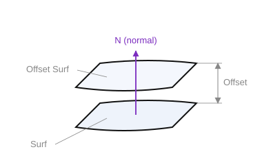

# Offset surface

`CreateOffsetSurf(ID, Surf: string; Offset: STFloat)` — create an offset surface. It is built by shifting every point of the source surface `Surf` along its **unit normal** by the distance `Offset`. The direction of the offset is determined by the **sign** of `Offset` and the sense (orientation) of the source surface.

- `ID` — identifier of the entity being created;
- `Surf` — identifier of the source surface;
- `Offset` — signed offset distance along the normal (`> 0` — along the normal `N`, `< 0` — against it).

