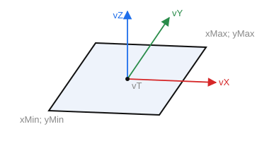

# Plane

`CreatePlaneP(ID: string; Location, Axis, RefAxis: TST3DPoint; xMin, yMin, xMax, yMax: STFloat)` — create a plane bounded by a rectangular region.

- `ID` — the entity identifier;
- `Location` — position (`vT`);
- `Axis` — the Z axis (`vZ`);
- `RefAxis` — the X axis (`vX`);
- `xMin`, `yMin` — the minimum X and Y of the bounding rectangle;
- `xMax`, `yMax` — the maximum X and Y of the bounding rectangle.

